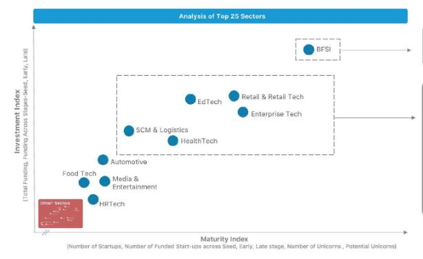

# CIE Assignment-1

- Name : P K Navin Shrinivas 
- Batch : CIE L1 A 
- SRN : PES2UG20CS237

## Question-1 : Official definition of a Tech Startup 

**Answer :**

To quote the NASSCOM Startup report : 
> An entity working towards innovation, development, deployment and commercialisation of new products, processes, or services driven by technology or intellectual property.

Tech startups are those bodies of businesses that reap the power of technology and solve problems in various sectors, some examples of such problem solving are : 

- BFSI : Empowering financial services through technologies such as Online banking, Crypto Currencies, Money transfer platforms.
- SCM and Logistic : Increasing efficiency and helping in management of supply chains by incorporating technologies in Warehouses, IoT platforms for Logistics, etc.
- Environment : Harnessing the power of analog machines to manage pollution and waste management.
- Heath : Using technologies to to make medicine accessible to all.

## Question-2 : Top 5 Industry sector that Indian Startups are focused on? Give one examples in each of the 5 industry sector/markets

As the question asks for Top 5 Industry sectors and not Tech sectors, we will be analysing the graph below from NASSCOM Startup report : 

A higher investment index isn't representative of focuses of startups, a higher maturity index shows the concentration of startups. That gives us these as the top 5 sectors startups are focused on : 

1. BFSI : Fintech and Financial services 
   a prominent example being : **JusPay** who work on payment gateways for eCommerce.
2. Enterprise Tech : Startups providing Enterprise soltions such as no code, remote management.
  A good example would be **WealthKernel** who provide a platform for companies who plan to provide digital investments

3. Retail : Startups providing a last mile approach to retail products come under this section. A well known startup in this sector will be **Nykaa** with its online retail shopping.

4. EdTech : Companies that provide upskilling or addons to primary education harnessing the power of internet come under this sector. A example that I'm sure we all will know is **upGrad** who provide upskilling for graduate and non-graduated alike.

5. Heath tech : Companies that make health care and othre related services accessible to all using technology come under this sector. A example under this would be **CureFit** with their very prominent existence in Bengaluru.

## Question-3 : Deep-tech industries 

The top 5 deep tech that is being used by startups are :

1. Artificial intelligence : **SigTuple**, using AI to give better diagnoses of various medical test.

2. IoT : **Allutix**, they are a IoT consultancy service and provide unique IoT solutions for a integrated solution.

3. Big Data : **Mu Sigma**, uses Big data to provide solutions to other industries in line of marketing, risk assesment and supply chain.

4. Block Chain : **Hyperlink Infosystem**, A company providing blockchain solutions to businesses.

5. AR/VR : **PlayShifu**, Aims to provide STEM education through AR/VR platforms.

## Question-4 : My view on Deep-techs 

### Big Data 
Gone are the days of oil being the deciding factor for a countries growth. Data is available in plenty, but unprocessed data is no better than unused data. 

Technologies like Big data can gain useful insights from massive amounts of data. But big data in my opinion is more than just gaining insights from data. If applied right, Big data can also lead to increased efficiency in other sectors such as agriculture, food storage, reduced interference due to developments.

India having such a large, not to mention dense population, This increased efficiency becomes a must at one point. With current tech in hand, India doesn't have the infrastructure to cater to the projected population growth towards 2050.
Big data along with increased infrastructure will be must to cater to this population growth.

### Block Chain 
Block Chain in theory is a privacy respecting data storage system. With the previous justification for big data, privacy goes on a toss. Block chain is a fitting solution.

Block chain is not all about privacy, Block chain can give 
banking and finances a new system to work with, if done correctly block chain can end up creating a very efficient currency in India, with India becoming a ecosystem with heavy BFSI maturity, This seems fitting.

