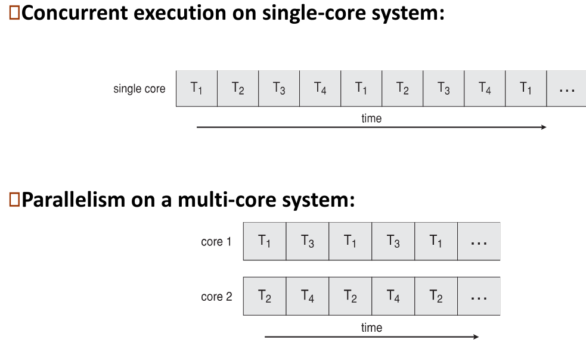
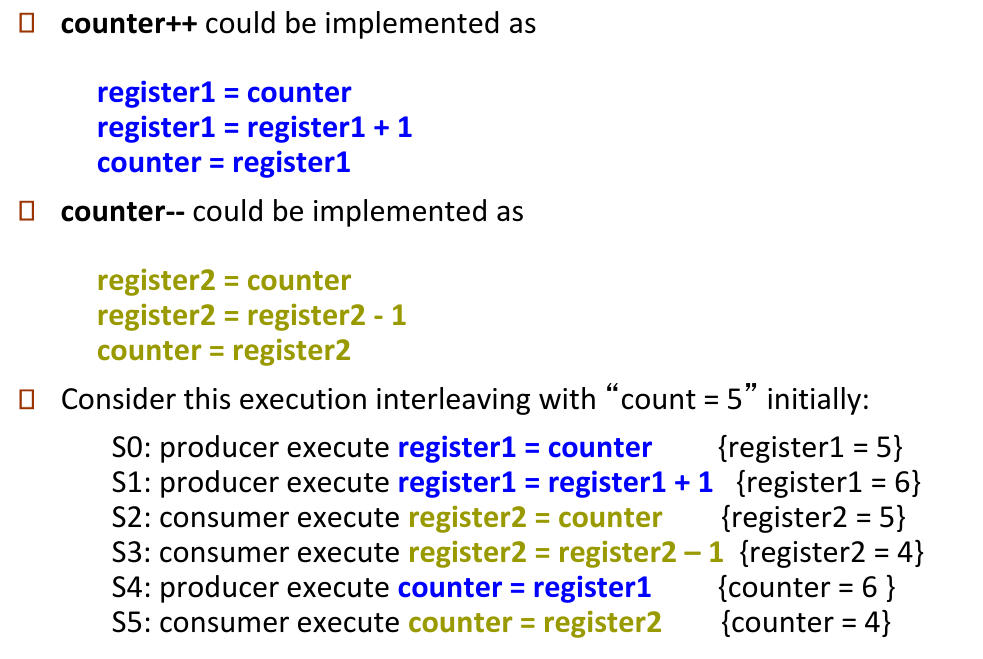
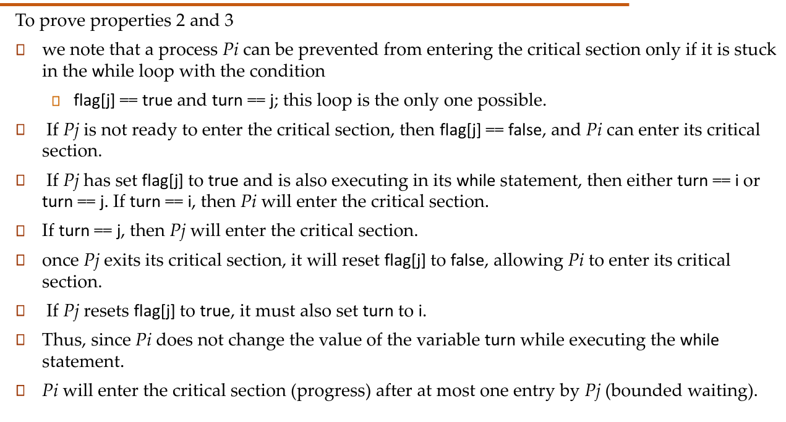
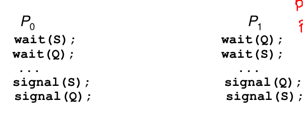

# Unit-2 : Threads and Concurrency 

## Threads 

### Overview 
- Unit of CPU utilisations, meaning? Well a a process is a collection of resources, where Threads are used to execute something on the processor. Every processor executes some process which ofc has atleast 1 thread.
- Hence a thread consists of : Thread ID, Stack, register set, Program Counter.
- Multiple threads of the same process can share as they are part of the same  memory space.
- Why thread instead of creating new process for each task?
  - Process creation is time consuming and heavy.

### Benefits of multi-threading : 
- Responsiveness : lets you execute other parts of the programm even tho something might be holding back other threads.
- Resources sharing : literally the same memory space, this is easier than things like pipes or shared memory. The programmer must specify the way of sharing even tho the threads are within the same address space.
- Cheaper : than process creation.
- Scalable : each thread can run on a separate processor letting it make full use of available power.

### Things that threads share : 
- Proces id, Proc grp id, parent proc,file descriptors, signals, file system related properties(umask, cwd, root).
- controlling terminal
- resources 

### Things threds don’t share : 
- Thread ID 
- Stack 
- Register 
- Floating point environments (All things need for floats, like exceptions)

### Concepts of threads 
- Threads have their own scheduling policies
- When a thread is spawned there is no saying which thread runs first
- When a new thread is spawned is has access to the memory space of process, it also inherits the fenv and signals.
- pthreads(a posix implmentation of user threads) does not set a errno variable, instead returns a error value(-1).

## Concurrency vs parallelism 
- Concurrency is single processor but multiple threads 
- parallelism is multiple processor and multiple threads 
- 

- Concurrency : can support more than one "task scheduling"
- Parallelism : more than one of those scheduled tasks executed simultaneoulsy.

## Multicore Programming 

### Types of parallelism 
- Data parallelism : distributes data across all cores.
- Task parallelism : distributes threads across cores. (Else each core can only process threads of one process).
- As the number of hardware threads grow so does support and archtechture for soft threads.


### Amdahl's law 
- the serial part of the program has large effect of the amount of speed gained by multicore systems. 
- speedup = 1/(S+(1-S)/N), As N=>INF speedup => s.


## Threads 

### User threads 
- management done by user level libs 
- Examples : Pthreads, Windows threads, Java threads.
- Used by programmers to handle multiple flows of a program.

### Kernel threads 
- Supported by the kernel 
- All GP OS have kernel level threads.
- Handled by the system scheduler, the user has no contorl over these threads.

These threads map to each other, cus finally they must be scheduled on to cores by system scheduler. 

### Mapping 
- Many to One 
  - Many user threads to one kernel thread. Solaris green threads, GNU Portable threads 
- One to One 
  - Each user level threads connects to one kernel level threads, when one spawn the other also.
  - More concurrency than many to one 
  - number of threads per process is sometimes restricted due to overhead of creating kernel threds everytime.
  - Linux, Windows, Solaris 9
- Many to Many 
  - Before solaris 9
- Two level model 
  - Same as many to many, but lets any user thread to be bound to a fixed kernel thread
  - Solaris 8 and before 

### Pthreads 
- Is only a specification NOT an implmentation, meaning this library can provide kernel or user threads depending on impl.

### Thread Scheduling 
- LWP :light weight process are simply threads in the user space that act as interface for ULT to systems resources. 
- Each LWP will have a single kernel level thread. 
- Contention means fighiting for resources 
- Process contention scope : threads withing the process fight for resouces given my LWP (meaning each LWP has multiple ULT)
- System contention scope meaning each thread within the process wait for LWP to fight for resouces, meaning each LWP has only 1 ULT and 1 KTL.
- PTHREADS_SCOPE_PROCESS/SYSTEM : *NIX only allow for SYSTEM.

> Notes : WIN32 thread lib is a purely kernel level thread management lib.

### Windows threads 
- Uses one to one mapping, but also has a fiber library that allows it to implement many to many.
- A private storage area given for all run time libs (DLL)
- WaitForSingleObject() : Makes the parent thread to wait will child thread terminates. 

##  Fixing parellel/concurrency  

### Preface 
- Concurrent access to shared data will mostly result in inconsistent data, we need some mechanism to maintain consistency. 

### Consumer Producer problem -> race condition and critical section
- Lets first consider the consumer producer problem : 
  - producer produces buffer 
  - Consumer consumes buffers
- Where's the problem at? 
  - The producer should produce data only when the buffer is not full. If the buffer is full, then the producer shouldn't be allowed to put any data into the buffer.
  - The consumer should consume data only when the buffer is not empty. If the buffer is empty, then the consumer shouldn't be allowed to take any data from the buffer.
  - The producer and consumer should not access the buffer at the same time.
- Intial Solution : Keeping a Counter, Producers adds one when producing, consumer reduces one when consuming 
- Code like this : 
    ```
    //Producer 
    while(true){
      //Produce some thing
      while(counter == BUFFER_SIZE)
        //do nothing
      buffer[in] = produced;
      in = (in+1)%BUFFER_SIZE;
      counter++;
    }

    //Consumer
    while(true){
      while(counter == 0)
        //do nothing 
      next_consumed = buffer[out];
      out = (out+1)%BUFFER_SIZE;
      counter--;
    }
    ```
- Sadly this leads to another problem, when two process access one memory location (counter) it can lead to race conditions. Not to mentions the buffer is also shared. In this case the counter variable starting with 5 should remain 5 after one counter++ and one counter-- , but we see it ends up being 4.
 
- So we need to come up with some way where the given variable can not be accessed by two processes. 
- Another problem we run into is the critical section problem, that is the section of the code where kernel data structures are modified. Simply at any given time only one process can be in the cirtical section. Each process has to ask for permission to enter the critical section.

### Solution requirement to critical section 
1. Mutual exclusion : is Process i is executing in its critical section, no other process can be in their critical section.
2. Progress : selecting a proces that will enter its CS next can not be postponed indef. 
3. Bounded waiting : A bound on the number of times some other process can enter its CS after a given process has made request to enter its own CS.

How are these handled in the OS? 
- Preemptive : Allows pre-emption of processes when running in kernel mode.
- Non Preemption : free of race conditions 
> Preemtion is more responsive and more suitable for real time systems. 

### Petersons soltuion : An implementation of previouisly discussed solution to CS problem. 
- Consider load store ins to be atomic (i.e can not be interrupted)
- A software solution for only 2 processes.
- Will have the two processes sharing 2 variables, int turn, bool flag[2]. 
- flag means it wants to execute, the turn state whos turn it is to execute.
- Code : 
    ```
    //for process i :
    while(true){
      flag[i] = true;
      turn = j; //
      while(flag[j] == true && turn == j){
        //Busy wait 
      }
      //CRITICAL SECTION 
      flag[i] = false; //It no longer wishes to execute CS.
      //REMINDER SECTION
    }

    //for process j : 
    while(true){
      flag[j] = true;
      turn = i; 
      while(flag[i] && turn==i)
        //Busy wait 

      //CRITICAL SECTION 
      flag[j] = false;
      //REMINDER SECTION
    }
    ```
- Does it comply with all the rules of the CS sultion criterions? 
  - Mutual exclusion : Yes, Process i can execute only if turn = i for flag[j] = false.
  - Progress, Bounded waiting? :
  - 

### Hardware solution for CS 
- Locking : lock applied during enrty section after which it enter CS and unlock happens in exit section.
- Here too all 3 criterion for CS solution stands true.
- For us to develop these solutions we need some atomic (in multi processors systems) instrcutions :
  - As seen in the ARM we often see the swap instructiong being atomic.
#### Test and Set Lock
- Has test_and_set as one operations that returns the old value of a memory and sets the new value, this instrcutions being atomic.
- If one process is executing test_and_set instrcutions no other process is allowed to execute this instruction.
- Code for test and lock : 
    ```
    boolean test_and_set(boolean* target){
      boolean rv = *target;
      *target = true;
      return rv;
    }
    //Both process need to use one same "lock" boolean variable.

    //Process:
    while(true){
      while(test_and_set(&lock)) //will move forward only when lock is false.
        //Do nothing

      //Critical section 
      *lock = false;

      //reminder section.
    }

    //Note test_and_set is considered atomic meaning we don’t have reace conditions on "lock" var 
    //And when lock is modified to false, its in critical section thus my mutual exclusion no other 
    //process will be modifying lock.
    ```
- There is no saying which process next gets the lock, whichever one (by luck) checks the test_and_set first gets executed. This violates the Progress and bounded waiting.
- We can also satify bounded waiting by changing the way process use the test_and_set instrcution. 
    ```
    while(true){
      waiting[i] = true;
      while(waiting[i] && test_and_set(&lock))
        //wait 

      j = (i+1)%n; 
      while(j!=i && waiting[j]!=true)
        j=(j+1)%n; 
       
      if(j==i)
        flag = false; //completley releasing lock 
      else 
        waiting[j] = false; //meaning some other process waiting in the while loop get to go forward where the lock is "virtually transffed".

    }

    ```

#### Compare and swap 
- executed atomically (again) 
- Code  :
    ```
    int compare_and_swap(int* value,int expected,int new_value){
      int temp = *value;
      if(*value == expected){
        *value = new_value;
      }

      return temp;
    }

    //Process : 
    while(true){
      while(compare_and_swap(&locak,0,1)!= 0)
        //Do nothing 

        //Critical section -> lock was 0 and is 1 when executing this CS 
        *lock = 0;
        //REMINDER SECTION
    }

    ```
- Process will keep waiting for compare_and_swap to return 0 (expected) and new value to be 1, which happens only when lock == 0 (expected).
- In this too we have mutual exclusion but no bounded waiting.

### Software solution for CS 

#### Mutex locks 
- Uses aqquire and release both of which are considered atomic.
- This solution need busy waiting tho, thus often called spinlock.
  - no contect switch when process is waiting for lock 
  - when locks are usually only held for a short time spinlocks are efficient 
  - often impl in multiprocessor systems.
- Code :
    ```
    acquire(){
      while(!available)
        //wait 
      available = false;
    }

    release(){
      available = true;
    }

    //Code : 
    while(true){
      acquire();
      //Critical section 
      release();
      //REMINDER SECTION
    }
    ```
#### Semaphores 
- They are a better (than mutex locks) to CS problem.
- Uses a integer S called semaphore
- Can be only accessed by by two operations wait and signal 
- Binary semaphore same as mutex locks (S can be 0 or 1), else we have Counting semaphore
- Code for wait signal : 
    ```
    wait(int S){
      while(S<=0)
        //wait 
      S--;
    }

    signal(int S){
      S++;
    }
    ```
- Mutex locks where atomic, wait and signal cant be atomic cus they have busy wait in them, that implies that wait and signal themselves become cirtical section problem 
- Hence semaphore impl with no busy waiting (block and wakeup) : 
- With each semaphore there is a waiting queue
    ```
    struct semaphore{
      int value; 
      struct process* list;
    }

    wait(struct semaphore* S){
      S->value--;
      if(S->values < 0){
        //add this job to list 
        block(); //Adds the job to the list
      }
    }

    signal(struct semaphore* S){
      S->value++;
      if(S<=0){
        remove from waiting list : Process P;
        wakeup(P); //Get it to ready queue.
      }

    }
    ```
> -ve S means there are jobs waiting to be excuted (hence the scheduling in signale), if greater than 0 meaning no jobs, simply release the semaphore.
- Correct usage of these semaphores is first wait and then signal, anything else can lead to deadlocks and starvation, one such example :
- 
- Priority inversion : when a process with lower priority hold the lock when a process with higher priortiy needs its, this is handled using priority inheritance protocol. 

### Priority inheritance.
When multiple processes are waiting for a lock/resources (each resource should have its own lock/semaphore). The proces that is currently holding the resource is given HIGHEST priority. This avoids the process from being preemted by intermediates priority tasks.
> Notes: when the process gets preempted it DOES NOT release the lock, meaning a proc (with priority above holding and below highest) can preempt the tasl with hold on resource and prevernting the process with higest to get the resources as soon as possible, hence the priortiy inheritance protocoll.

## Solving classical sync problems using semaphores 

### Bounded buffer 
- Same as consumer producer with n buffers 
- Semaphore mutes : init 1 (binary) //Lock
- semaphore full : init 0 //Number of full buffers
- semaphore empty : init n //Number of empty buffers
- Code :
    ```
    //Producer 

    while(true){
      //Produce something 
      wait(empty);
      wait(mutex);
      //Add to buffer 
      signal(mutex);
      signal(full);
      //remaining
    }

    //Consumer 

    while(true){
      wait(full); //wait till full>0 and then decrement
      wait(mutex); //acquire lock
      //consume 
      signal(mutex); //release lock
      signal(empty); //Increment empty
    }
    ```
### Reader writer problem 
- Multiple readers but only single writer 
- If write is active read cannot happen.
- If some other read is hapenning we need not check the rw_mutex cus its obv write is not hapenning 
- So we also maintain a read_count which writing to which is considered CS cus we have to avoid race conditions at any cost 
- rw_mutex : init 1 -> binary 
- mutex : init 1 -> binary  //for writing to read_count 
- read_count : init 0
- Code : 
    ```
    //Writer : 
    while(true){
      wait(rw_mutex)
      //writing 
      signal(rw_mutex)
    }

    //reading : 
    while(true){
      wait(mutex)
      read_count++;
      if(read_count == 1) //first reader has to wait for writing to end 
        wait(rw_mutex) 
      signal(mutex)

      //read happens 

      wait(mutex)
      read_count--;
      if(read_count == 0) //If no more reader write mutex is released
        signal(rw_mutex);
      signal(mutex);
    }
    ```
### Dining philosopher problem 
- Say 5 guys alternate between eating and thinking(some time all of them want to eat too), they are seated in a circular fashion and need 2 chopsticks simultaneoulsy to eat.
- Semaphore : chopstick[5] -> all binary semaphores.
- Code : 
    ```
    while(true){
      wait(chopstick[i]);
      wait(chopstick[( i+1 )%5]);
      //eat  
      signal(chopstick[i]);
      signal(chopstick[( i+1 )%5]);
      //think
    }
    ```
- Problem being that no 2 neigbours can eat at the same time 
- Can cause deadloc (if all 5 end up pickikng left chopstick, which can happen due to different semaphores) and leads to starvation.
- Solution?
  - Only 4 diners can sit 
  - Allow a diner to pick chopsticks only if both are available, meaning that too must be done in a critical section.
  - Use assymentric solution. Im tired cant type more :L 

## Deadlock handling 
- Several processes waiting for the same resources.
- When is a deadlock? When the 4 are saified by any 2 processes 
  - Mutual exclusion
  - Hold and wait 
  - No preemption
  - circular wait 
### Resouce allocation graph 
- Helps with detection and handling of 
- If graph has no cycle then no deadlock 
- If graph has cycle 
   - If only one instance of every resource, then deadlock. 
   - If several then may or may not be deadlock.
  - detecting deadlock take n^2 time 
