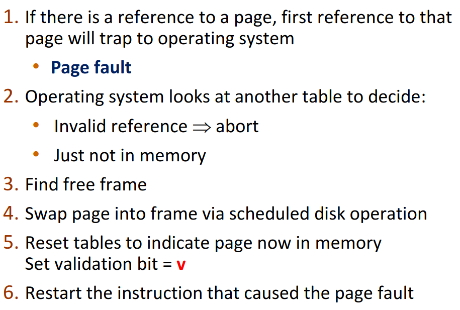

# Unit-3 : Memory 

## Introduction | Hardware outline 

- Program execution : 
  - Fetch instruction from Memory
  - Decode instruction
  - Fetch operands from memory or registers
- All the above stream of bit is seem by MU (Memory Unit)
- Even the program has to be fetched from the DISK to MEM 
- CPU can only directly access memory and register
- Reg's can be accessed in one cycle, mem takes more.
- Cache does speed up mem access, but it is never controlled by OS
- These memory spaces have to be protected from other procs and should be done through hardware
  - This is done by using a base register and a "limit", these two together define the logical address space
  - On every access, the CPU must check if the address being requested within the address space:
  
  - CPU checks in the following order : 
  
  - The base and limit values can be loaded only by the OS using special instructions in the kernel mode
  - Often program has to be loaded from disk to mem, hence the need for symbolic [relative] addresses : 16 bits from the start of this module. Linkers and Loaders later convert this to absolute address relating to mem
  - Base address is also called **relocation address** [Stored in **relocation register**], it added to every address that is generated by linkers and loader in the user space.
  ```
    if base address : 1400 and user tries to access 0, it is mapped to 1400
    Simply the user programs only deals with logical address, and these are later bound to physicall address
  ```

## Memory Management Unit : MMU 

### Adrdress Binding Schemes:
- So we'ev seen before that address spaces are protected by base and limit values, so that mean the address for the needed program needs to be calculated, It can happen in one of the following ways:
  - If we know where the process will reside in the memory, we can generate those addresses in **Compile Time**
  - If we dont know where it resides by once loaded to mem it doesnt move around, we can do it in **Load Time**
  - Else if it can move around during execution, we do it in **Execution time**

- To be noted that even the ones coming out of compiler are not within the protected address space, that is handled solely by the OS, they are only logical addresses, physical addresses are seen only by the MMU
- MMU is a hardware device that maps logical addresses to physical addresses
- Logical addresses are those generated by CPU, physical are generated by MMU 
- If the binding scheme is compile or load time, both are same. In execution binding scheme they vary

## Linking

Often a program needs other system libraries and modules, now there are two ways a user program and system library are joint [LINKED] together. Ways of linking : 
- Dynamic linking : Linking done during execution time 
  - **stub**, a small piece of code used to locate the need for system libs, stub replaces itself with address of system routines
- Static linking : The system libraries are compiled together with the user program and included in the binaries


A program that is statically linked expects every system that it runs on has those exact sys libs. More over versioning/patching system libs is much easier on dynamic linking.

## Swapping

Why swapping? Often times the process is by itself bigger than the available memory, in these cases the process must be waspped in and out of the main memory and disk.
Way of doing this : 
- Backing store : A fast large disk large enuf to store all of memory images for all users.Must have direct access.
- Roll in Roll out : its a swapping variant used in scheduling algorithms to swap higher priority processors with lower priority. 
So once the process is swapped out does it have to return back to the same memory space? This depends purely on the binding method.

If a needed process is not in memory, it often has to be "swapped" with a proc in memory, this is context switch and often takes a lot of time.
Also some times the older proc is still waiting on I/O and if swapped abruptly the I/O result goes the wrong proc.
  - This could have been avoided by putting all I/O operations under kernel space (filter sort of thing), but this adds unessecary over head. 

## Efficient Memory

### Contiguous Mem Alloc

So we by now know, the memory must store the OS stuff and the Proc stuff. But this must also be veryyyyy efficient, Contiguous memory is a good way to go.

- Usually into two partitions with OS in the one with low interrupt vector
- Proc's next, each of their memory also held in contiguous space.

- Every time the CPU selects a proc to execute it loads in the relocation and limit register 
```
   To be noted : limit register will not be addendum of reloca reg, as seen in diagram
```

### Patritions  Allocation
Another way of doing efficient memory is using multiple partitions 
- divide mem into multiple partitions, each partition can be taken up by one proc 
- Amount of multiprogramming (simultaneously) depends on the no. of partitions.
- Few OS allow for variable size partition
- **Hole** : Free space scattered around the mem, hence the OS tracks all the free[Hole] and taken up partition, its must the hole must be big enuf for the entire proc, no fragmenting the process 

[internal vs external fragmentaion](https://www.geeksforgeeks.org/difference-between-internal-and-external-fragmentation/)
```
   Internal fragmentation occurs when we split the physical memory into contiguous mounted-sized blocks and allocate memory for a process that can be larger than the memory requested. Hence, the unused allocated space is left and can’t be used by other processes. Best fit block search is the solution for internal fragmentation.

External fragmentation occurs when total unused memory space is enough to answer all the allocation requests. Here the memory is non-contiguous. Therefore, the memory has empty blocks scattered all over, which are insufficient to be allocated to other programs. Compaction is the solution for external fragmentation.
```

**Advantages :**
  - No internal fragmentation (We give the process exactly what it wants)
  - No limit on size of proc (variable part)

**Disadvantages :**
  - Causes external fragmentation (we give exactly what we want, but not contiguously)
  - Difficult implement?

**Strageies to allocate holes :**
  - First fit :First hole that is big enuf (very fast)
  - Best-fit :Smallest hole that is big enuf  (Leaves smallest left over hole) (Must go through whole mem to find space, linear)
  - Worst-fit :Allocate the largest hole  (same as last, linear)

### Fragmentation

We saw about fragmentation a short while back, how to solve then? We use **compaction**

Shuffle all memory contents such that they are placed together, this is a solution for external frag imo
compaction is possible only during exec time and relocation is dynamic

### Segmentation Mem Management

One more way of doing memory, to sum up mem management so far : 
```
   1. Contiguous : fixed sizes that are filled up contiguosly, only one space per proc 
   2. Patritions : only one proc per partition, variable in size not contiguous 
```
So what is Segmentation den?  variable size segments, but a proc can span over multiple segments.
Also allows for non contiguous storage.

Hence here a logical address has the following info : <segment no. , offset> 
All this is translated using a segment table having base address and limit, So make it easier for uus take a program, its data may sit in segment 1 and instructions say in segment 3. So a flow chart will make much more sense now :


In the segment table we can also assosiate read write permissions. OS does the job of looking into the segment table and loading base and limit into the respective register

Question : can a process use 2 segments that are not near each other?

The above question cus, slides say Segmentation causes external fragmentation, but if we can have segments far apart, I dont see how.

> Note : All mem managment that allows to variable size of partision is called dynamic mem management


### Paging Mem Management

Ok the question from previous section has been cleared here, segmentation DOES allow the physical address space to be non contiguous.

Paging here also allows the above, but it also solved the problem of fragmentation in backing store. Here in paging diffrence between logical and physical addresses get evident.

- Physical mem : split into frame powers of 2 
- logical mem : split into pages of same space.
- Keep track of free frames, is a program is of N pages find random (non-contiguous) N frames in the memory and load up the programs

 A page table is kept to convert logical addresses to physical, backing store also split into same sizes of frames, Now we can have internal fragmentation :angry:. In diagram : 
 

 the page table has two values, page number and frame number, the logical address in the other hand has : page number and offset
 

 in the above example, for data c : ( page number,offset )=>(0,2)===page table==>(5,2)

 So now Advantages and Disadvantages : 
 - Each mapping takes up space in page table 
 - internal fragmentaion (worst case : entire frame-1byte , avg case : 1/2 frame)
 - Some kernel/OS allow for variable page size.
Now we are back to having to large context switch time, cus if there is not, so lets solve that using TLB.

**TLB** 

we can make page tables using register, but that mean they can only store page details of few pages at a time, leading to more context swtiches. So we can instead use a TLB, a fast cache.This cache points to page tables in memory.

page table is kept in mem : 
- PTBR : page table base register : starting of page table 
- PTLR : page table length register

But that does also mean for each address fetching we need 2 mem access. This is where TLB's come in. TLB's store ASID address space identifiers, on a miss TLB will get the value to cache for faster access, but replacment strategies have to be considered for this. To sum it up in a diagram : 
- If the TLB doesn’t use ASID then the entire cache much be flushed on context switch.


Just as in segment table, paging also can to read write prottecc

**Structure of pages tables:**
- 4KB page size 
- Page table can have millions of entries, 2^32/2^12 (2^32 cus 32 bit system tot adressable, 2^12 for 4KB)
- each entry is 4 bytes to 4 MB, we dont have this amount of space for records.hence we have a few paging varaitions : 

1.Hierarchical paging 
- Something like 2 level page tables, and each page of the first layer is in itself is a page table, this ofc changes the logical address : <p1[]12 bits,p2[10 bits],offset[10 bits]>

- On a 64 bit system 2^64/2^12 => 2^52 => can be split into 2^42 entries in first page table and 2^10 in internal page tables. This is still big, so we could have 3 levels of 

2.Hash page tables
- Its basically Seperate chaining collision avoidance page table management
- Each node contains : page number, mapping frame, pointer to next node

3.Inverted page tables

So far whatever we have seen keeps a seperate page table for proc, inverted page tables keeps one for all, one entry for each page memory. This does reduce the space needed, but increases the search time as entire table has to be searched everytime we need a frame. For that we can use hashing and TLB's to increase access speeds.

So now the logical address : <Proc id, Page table,Offset>, ones that do implement inverted page table have a hard time with shared storage.

Example : Intel IA-32 arch 

Each segment can be as large as 4GB, up 16k segments per proc, has two partitions : 
- 8k segments for private procs : LDT : local descriptor table.
- 8k segments for shared b/w all : GDT : Global descriptor table.
- logical address : <s,g,p> :
  - S : segment number [13]
  - g : global or local [1]
  - p : protection bit [2]
- Offset is s 32 but number, that gives the offset withing the segment.
- This generates a linear address which is later given to page table to map to physical memory 
- To me this Intel arch is very confusing, hence ill stop bs'ing here with this diagram : 


- If you have though a little about memory, you know that 32 bit systems can max handle 4GB ram, intel came up with PAE (page address extension) that allows us to use more than 4GB mem.
  - 3 level paging
  - page entires use 64 bit 

## Virtual memory 

Now waht? Another memory.... ah shit, anyways, virt mem allows us to execute procs that are not in mem yet. So proc can be bigger than mem and we dont need backing store. This virt mem allso makes it easier for shared storage.
- Rarely the entire program is used, hence consider executing partially loaded proc.
  - lesser mem for each proc
  - Increased CPU throughput
  - lesser I/O
- Using virt mem we can split logical and physical, no need to keep one to one mapping. i.e logical can be much bigger than the physical mem.
  - virt mem space : starts from 0, contiguous 
  - MMu must map virt addresses to Pages in physical
  - Implemented using demand paging and demand segmentation


Virt addresses start from max and grow stack from max, heap grow from bottom.
Each proc has its own virt space : 


Previous mentioned demand paging, what is it? 
Bring page to memory only when needed, its literally paging with swapping. Bringing pages into memory only when needed is called lazy swapping, the swapper that deals with pages is pager.
- pager guesses whihc pages will be used again before swapping
- The page hit or pages miss is now represented using valid invalid bits in the page table, if its not in memory and page table tells i, it is called page faults
- Lazy to type, hence steps in pagefault : 



Pure demand paging is when exactly what is needed is got to the mem, but by using conept of locality of ref, we also bring the surrounding stuff into scope. So what all hardware do we need? 

- Page table with valid [v] invalid bits [i]
- Ofc seconday memory
- instruction restart

## COW say MOO 

COW : copy on write, when a parent and child try and share the same mem pages.
COW makes memory man more efficient as only modified pages are copied.

vfork() is variation of fork() such that parent and child have same copy on address space.

If there is no space for the copy wat to do? replacement strategies. But now its possible that the same page is brought inot the memory too many times. This can be avoided by modifying page fault routines to accomodate page replacement.

Now we can use a "dirty" bit to see

SOOOOOo replacement strategies : 
- Find a free sapce, if it exists use it. 
- else find a "victim" frame, use replacement srategies for it. If the selected vicitm is dirt, write to disk else ignore
- Bring to mem, update page table.
- Now its possible we increase EAT (estimated hit time)

## Replacement strategies 

### Frame alloc : 
- Amount of frame to alloc for each proc 
- Which frames to replace 

#### Page alloc : 
- We need lowest page faults
:


