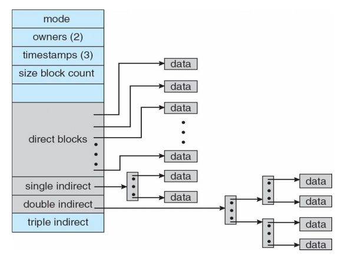

# OS Unit-4 Notes 

Do not be deceived by the starting of this document, it has only the important parts for Unit-4.


## Files 

### Introduction

As humans have attributes and chareteristics, so do file : 
- Name
- ID
- Type
- Location
- Size
- Permissions
- Time, date, user of modification and creating

These files are kept on a secondary sotrage device in a directory structure.

In directory structure each file gets a **"directory entry"**, this entry has a unique identifier that can identify and locate file and its attr.

### File Operations

- Create 
- Write : A write pointer shows where to write in the file.
- Read : Read pointer.
- Seeking : Repositioning pointer within the file.
- Delete
- Truncate : Erase file but keep its attributes, overwrite.
- Appending : Add to EOF.
- Open : 
  - **"Open-file table"** tracks open files 
  - File pointer : both read and write pointers, **per process for all precesses that have the file open!**
  - File-Open count: # of times the file is open,this allows the deletion of records from open file table.
  - Thus of an open file :
    - File pointer
    - File open count 
    - Disk location of file
    - Access rights

### Open File 

> A readers/writer lock regulates access to a set of data. The readers/writer lock is so called because many threads can hold the lock simultaneously for reading, but only one thread can hold the lock for writing.

- Shared lock : Similar to readers lock 
- Exclusive lock : Similar to writer lock 
- OS takes care of permissions and access to the files.
- Mandatory : Access is denied if bad locks.
- Advisory : Process themselves can see lock status and see what to do.

### Access methods 

- Sequential : one by one [read next, write next]
- Direct : direct seeking [read n,write n], where n is index relative to starting of file.
  - reset : cp=0
  - read next : cp=1;read cp;
  - read n : cp=n;read cp;
- Other access methods : 
  - creation of an index file :eyes: 
    - keep this index in mem for fast access.
    - If this index gets too large, make index's for index
    - First one has pointers to index files, which have pointers to data.
  - Actual example of index based access is IBM's ISAM, which has 2 layers of index, all index's are searched through Binary search meaning they are sorted by some key.

## Director to the victory! 

We just saw that directory is a collection of directory entires of ID's.


## Disks. Yeah no punny names, move on. :/

### Disk Strcture 
- Each disk can be split into partitions 
- Partitions can be RAID protected and parelleised.
- Partitions can be raw or formatted with some FS[is so called volume].
- Partitions => mini disks, slices.
- Info about the FS on partition is tracked in the device directory. Making it such that every FS fas atleat one directory.

### Directory structure 

struct of directory entry in UNIX systems : 
```C
struct dirent{
    ino_t d_ino;      //Inode number
    char d_name[256]; //dir name 
};
```
Directory is used cus : 
- Easier naming, two files with same name.
- Easier to organise 
- Faster to do operations on. 

So hows does a multi user system work? Best practice is to give each user their own directory.

### Two level directory

When the user log's in an "MFD : master file directory" is searched. this returns back and UFD, when the user asks for a file, only his own UFD is searched.

But this UFD can only have one list of directory. Hence no logical grouping.


### Tree structured directory 
Most common and allows for very nice grouping.

### Acyclic graph directory 
One file can be in 2 places, but there are no cycles allowed, like dis : 


but this leads to dangling pointer and can be solved using back pointers. 

### General graph  

Allows for sycles, but : 
- Costly cus it needs garbage collection.
- How to ensure no cycles then? [In other methods that is] :
  - Allows links only to files not sub direcotries.
  - everytime a new link is added, run a cycle detection algorithm

## More on Files

### File system mouting 

A FS must first be mounted before it can be used, the place of mounting is called a mount point.

### File sharing 
 
- Sharing could be done through a protection scheme
- On distrubuted systems, Files have to shared across systems. This is often done using NFS : network file system
- So first permission can be handled using UserID's and GroupID's
- NFS is UNIX std, CIFS is Windosss std.
- Shared file systems apply few things to be resiliant to file corruption and network messes.
- Stateless protocols such as NFS v3 inclues all informations in very request and response, making it easy to diagonise.
- Consistency Semantics : 
  - A concepts which is used by users to check FS to check which FS in their system supports file sharing.
  - Speicifcation on how in a single system is giving multiple users access.
  - eg : when one modifies one file, is it reflecting to others in real time?
  - UFS : cahnges visible in real time, allows multiple read write pointer concurrently.
  - AFS : Only visiable to session starting after the file is closed.

### HAHAHAH, the same old permission :)
bits : Read write execute

        1     1     1      => 7

        1     1     0      => 6

        ...

Groups : Owner Group Others 

          7       7     7   => Not a great idea for security.

### Propertise of a file : 
- stat : returns a struct of properties
- fstat : return info about file open in the file descriptor.
- lstat : give infor about the sym link, not the file in symlink.
- fstatat : give the inof about a file relative to the file currently open in the fd.

### code related to POSIX std file systems : 

#### Macros : 
- S_ISREG()
- S_ISDIR()
- S_ISCHS() : is charecter special file, gives unbuffered i/o access.
- S_ISBLK() : is block special file
...

- lseek : 
  - modifies "current file offset"
  - Most read and write operations happen from beginning of the file, unless u are doing stuff like append. Enter lseek 
  - can set yo pointer and work it using : 
    - SEEK_SET 
    - SEEK_CUR 
    - SEEK_END sets to end to file 

## IMP :  Implementing FS : 


- FS are logical storage unit residing on secondary disks.
- The FCB : file control block has the information about all the permissions and location [File Control Block]
- DEvice Drivers control the physical device.
- A file system should :
  - Convert commands to device driver code 
  - Hold frequently used data in cache and handle buffers.
  - A very nice  diagram of FS :
  - 
- File organisation module : translates logical block # to physical block #. Manages free space. 
- Logical File System : manages metadata info. Directory management,protection.
- "Layering" useful for reducing complexity and redundancy, but adds overhead.
- MBR is present in the first sector of any hard disk that identifies where the OS lives.
- Boot blocks contain bootstrap programs.
- Volume control block : contains tot # of blocks, free blocks.
- As seen before FCB : contains permission, size, dates.
- NTFS stores into Master File Table using relation DB.

### Partition and Mounting 
- Root partition holds the OS 
- During boot time FS consistency is checked, whether or not all metadata is correct.

### Virtual File system

Provides an Object Oriented way of implementing File system.This allows for same API calls for different File systems.The VFS in turn calls the right FS routines.
Example, Linux has 4 objects : 
- Inode 
- File object 
- Superblock 
- dentry 

### Allocation 
- Contiguos allocation : OFten time has the best performance, and very simple to implement as we need to track only endins and starting addresses.
  - Ofc we have the fragmentation problem and needs conpaction
- Extent based systems : modified Contiguos alloc
 ```
An extent is defined as one or more adjacent blocks of data within the file system. An extent is presented as an address-length pair, which identifies the starting block address and the length of the extent (in file system or logical blocks). VxFS allocates storage in groups of extents rather than a block at a time.
Extents allow disk I/O to take place in units of multiple blocks if storage is allocated in consecutive blocks. For sequential I/O, multiple block operations are considerably faster than block-at-a-time operations; almost all disk drives accept I/O operations of multiple blocks.
Extent allocation only slightly alters the interpretation of addressed blocks from the inode structure compared to block based inodes. A VxFS inode references 10 direct extents, each of which are pairs of starting block addresses and lengths in blocks.
```
- Link list of blocks : each file is list of blocks. 
  - No external frag 
  - Relisbailty can be a problem
  - Loot of seeking
  - Linked 
- FAT is an implmentation of linked alloct, ofc with modifications
  - Beginning of volume has a table, index by block numbers.
  - cacheable and faster that linked allocation
  - Unused blocks are represented using "0"
- Index alloc : Each file has its own index table, a table of pointers to its won blocks, as seen before can be in multiple layers.
  - Gives direct access to files and its blocks 
  - No external frag! 
  - Pointer overhead is too much
  - say for a tiny file of 2kb, a entire blocks [With internal frag] is a huge waste of space.
  - For files that are tooo huge, single index table block wont be enuf
  - So some time other ways of allocating storage is used, but often mutiple layers of index table are implemented, like this : 
  - 

### Comparing allocation methods : 
- Contiguous : best for sequential and random, but frag 
- linked list : best for linear access
- Index : more complex 
  - Can need many index layers 

### Free space 
- We keep track of all free blocks for faster allocation and reusing of free space from deleted blocks.
- The free space list is implmented as as a bit map of a bit vector
  - Each block is rep. by 1 bit, index starts from 0, free blocks are rep. by 1.
  - Only way to find a free block is for searching sequentially for , the blocks address can later be calculated : # bites/word * # of 0 words + 1
  - Its only practical to store bit maps of small disks

