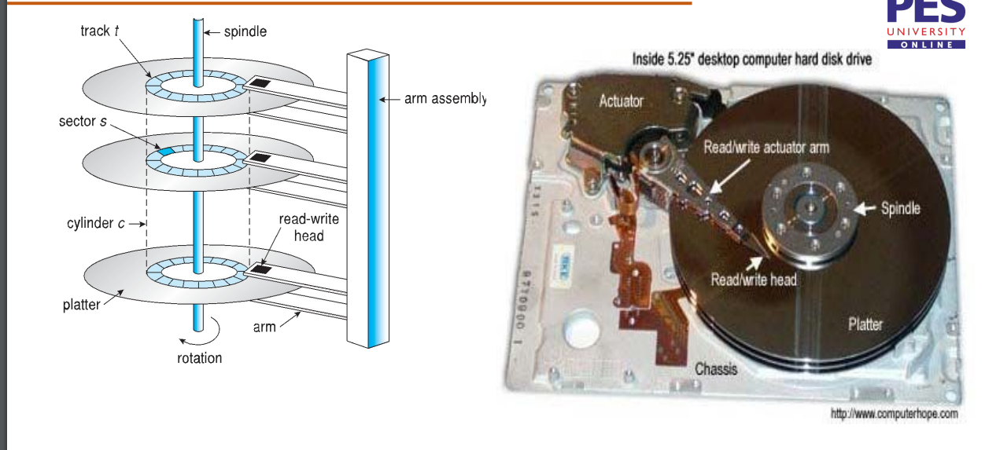
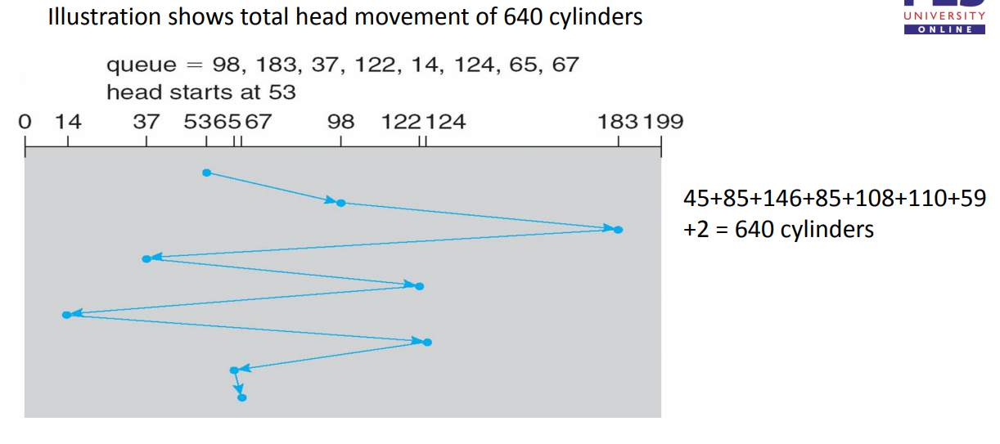

## Mass storage 

### Hard drives : HDD

- Has sectors, cylinders, tracks :
  - 
- Fetching data from disks has two parts : 
  - Moving the head to the correct cylinder (Seek time)
  - spinning the disks to the right sectors (rotational times)
- => disk latency = seek time + rotational latency
- Some times the head falls into the disk causing "head crash" and is non recoverable
- Drive are attached to the motherboard by various I/O busses, such as : 
  - SCSI
    - Harder to configure
    - Supports more disks per computer 
  - SATA/ATA 
  - USB
- the host controller in the motherboard talks with the device controller inbuilt in the devices.

### Solid state drive : SSD

- More reliable than HDD, expensive but much faster. Standard I/O busses maybe too slow for SSD and hence connect directly to system through PCI
- No moving parts 

### Magnetic tapes 

## Disk Scheduling 

- The OS is responsible for fast and efficient retreival and storage of data.
- Minimizing seek time is one way to reduce latency, the seek time can be considered proportional to seek distance.
- It only makes sense to have algorithms when the requests queue up, then we can select which one to service first...Rightfully so disk controllers have very small buffers that can handle varying lengths to I/O, following are the disk Scheduling algorithms : 

### FCFS (the normal way)


### SSTF : Shortest seek time first
- may cause starvation to few requests 

### SCAN : Important ones 
- the head starts at one end and move towards the other service all requests is recieves one the way, after reaching the end its direction changes and the service continues. 
- SCAN also called elevator 


### C-SCAN : Circular SCAN 
- the head starts at one end and move towards the other service all requests is recieves one the way, after reaching the end it resets its position to the first.

### LOOK and C-LOOK
- ARM goes only as far as the last request and immediately  reverses direction.


### Conclusion 
- SCAN and CSCAN are better for systems with large load, Lesser starvation.
- SSTF or LOOk are suitable for default algorithms
- Its hard to comtrol rotation latency and thus manufactureses try and implement algorithms in the device controller itself.

## Swap Space Management 
- Usage of disk space as an extension of main memory, often not done these days dues to increase in memory and very slow main memory often leading to worse performance
- Swap space can be made out of file system itself, or it can be a separate disk/partition by itself.
- Swap management : 
  - BSD allocates swap space only when the program starts
  - kernels use swap maps to track swap usage 
- In Linux : 
  - Linux allows one or more swap spaces 
  - Each swap area consists of 4kb page slots.
  - Each swap area has its swap map, where:
    - 0 => page slot is free
    - 3 => swapped pages belongs to 3 processes

## RAID : Redundant Array of Independent/Inexpensive Disks

### Basics : 
-  Disk Org technique, finds a balance between performance and reliability.
- Single large disks leads to single point of failure and too expensive (large disks are expensive), leading to the usage of may smalled disks
- Idea is to use multiple disks to achieve redundancy and speed.

### Striping 
- Writing a particular file/data to multiple disks at the same time, possibly by bit level striping (each bit gets is assigned a specific disk) or block level striping. This leads to both increase in read and write speeds.

### Mirroring 
- Keep two copies of all data, if one is lost fetch from another...This is open approach 
- Store enuf extra data such that in case of data loss, it can be rebuilt fairly quickly 
- This ofc increases reliability and redundancy, but write speeds take a dunk (to write the extra data or clone everything), read speeds to see an increase incase of cloned data, hence hot spares are left (empty drives) in servers for rebuilding purposes.

### MTTF : Mean Time To Failure
- Usually writing to multiple disks (Striping) reduces MTTF (which is bad)
- As said before we can rebuild/repair disks, time taken for this is called mean time to repair.

### More about RAID 
- often used with NVRAM to increase performance (Non Volatile RAM)
- There exists 6 levels of RAID

### RAID-0 
- Simple striping without any redundancy. With increase in number of disks involved in striping reduced MTTF

### RAID-1 
- Complete mirroring
- 0  Mean time to repair 
- write performance suffer 
- expensive 
- Needs twice as much as storage space :clown:

### RAID-2 

- Uses ECC for redundancy (Error correcting codes), Hamming codes for ECC.
- Hamming codes, bes video : https://www.youtube.com/watch?v=X8jsijhllIA 
- So we see that the number of hamming codes bits needed depends on the block size, but considering some standard, the slides and text book says we need 3 disks for storing hamming codes of 4 disks worth of data (this is one less from raid-1)
- Striping is bit level here, hot spares are used to rebuild this data. 

### RAID-3 

- Bit level striping here as well, so whats different then?
- RAID-2 needed soo many ECC drives such that we can detect which drive if the one that failed.
- But modern disks can by themselves report that they are broken (also point out which sector).
  - i.e they have ECC for each sector 
- Hence just one drive for parity bit will work, this is again similar to the video quoted earlier (the 0th bit as sum partity) and sector ECC for determining for said row and cols. But this parity has to be calculated.
- Thus leading to worse write performance.

### RAID-4 

- Same as RAID-3 but block level striping
- the parity is now calcuated using blocks
- Using block parity leads to faster smaller multiple reads, write still remain bad.

### RAID-5 

- Block level striping with blokc level parity, ibut no dedicated parity drive. This remove the write restrictions (i.e we can have multiple write cus each drive is responsible for its own parities).
- read and write are similar to those of raid-1!!

### RAID-6 

- same as raid-5 but instead of writing parity of one drive to itself, the parity is copied once more.
- meaning instead of have 1 drive worth parity, we have 2 disks.
- also means we need atleast 4 drive for raid-6 to be possible (think along the same lines for other raids as well.).
- trasmissions are little lesser than raid-5 cus more stuff to write.

### RAID-10 (raid-1 + raid-0)
- 0--->1----->output
- meaning, any data coming is first mirrored, then its striped across stuff.
- rebuilds times are theoretically 0.
- Sadly 1/2 the space is wasted to redundancy.

### RAID-01 (Raid-0 + RAID-1)

- Any data coming in is first written in a striped data and then mirrored (It turn out to be almost the same :/)

### Conclusion  

- Selecting data RAIDS depends on the use case.

## Protection Domains

- In UNIX systems, the first digit of a 4 digit permission system : 4 - set user id  2 - set group id 1 - sticky
```
   The first digit in a four-digit permission is the sum of set user id (4), set group id (2) and sticky (1). A three-digit permission is just like a four-digit permission with the first digit set to zero. Thus:

0644 is exactly the same as 644.
1644 is like 644 but the sticky bit is also set
4644 is like 644 but the set user ID bit is also set.
Examples of uses for the fourth-digit permissions
If a file with set user ID is executed, then it is executed as if by the owner of the file rather than the user doing the executing. Thus, for example, /bin/mount is commonly owned by root and has permissions 4755 where the 4 signifies that, even if executed by a normal user, it will run with the owner's (root's) privileges.

Setting group ID on a directory is useful for sharing files.

The sticky bit is used on directories like /tmp so that all users can create files but prevents non-owners from deleting other people's files. Thus, the permissions of /tmp are typically 1777 where 1 signifies that the sticky bit is set.

Documentation
From man chmod:

A numeric mode is from one to four octal digits (0-7), derived by adding up the bits with values 4, 2, and 1. Omitted digits are assumed to be leading zeros. The first digit selects the set user ID (4) and set group ID (2) and restricted deletion or sticky (1) attributes. The second digit selects permissions for the user who owns the file: read (4), write (2), and execute (1); the third selects permissions for other users in the file's group, with the same values; and the fourth for other users not in the file's group, with the same values.

```

- Domain switches achieved through passwords. Sometines through commands(sudo).
- There exists a ring like structure for protection domains.0-7. One executing in 0 have highest previledges.


