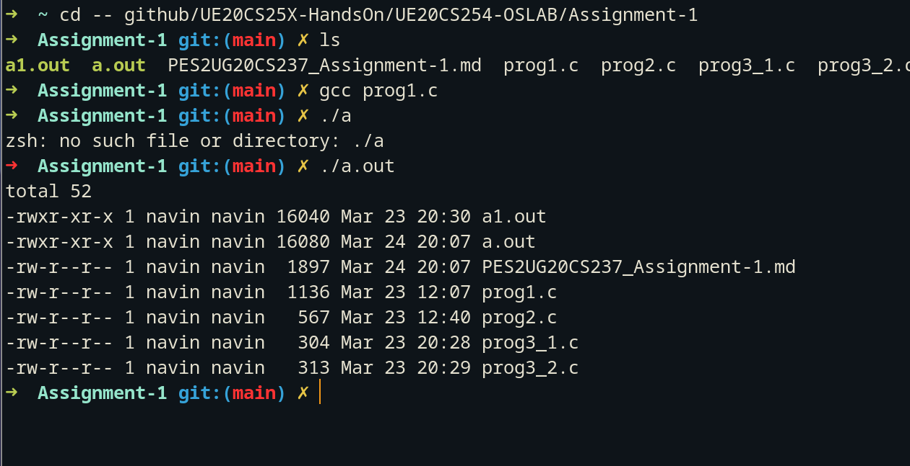
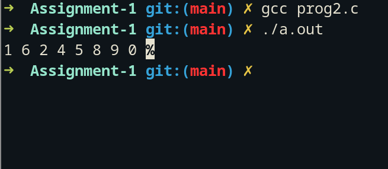
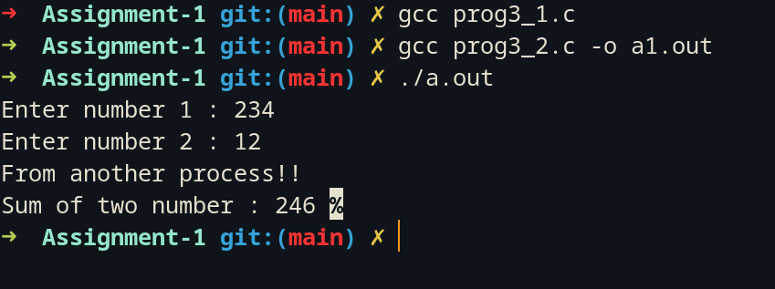

# OS lab submission-4

- Name : P K Navin Shrinivas 
- Section : D 
- SRN : PES2UG20CS237

- 2 Programs were shown in class

## Program 1 : Parent child files listing with file size

```C
#include <stdio.h>
#include <stdlib.h>
#include <sys/wait.h>
#include <unistd.h>

int main() {
      pid_t p1;
      p1 = fork();
      if (p1 > 0){//parent proc
          wait(NULL); //wait for child proc to exit(0)
      }
      if(p1 == 0)
     {
      execl("/bin/ls", "./", "-l", NULL);
      exit(0);
     }
}

```

**Screenshots :**



**Questions :**
- How are we avoiding zombie processes?
  - We are using wait(NULL) that keeps the parent process from not finishing until the child process return a 0 signal.


## Program 2 : Parent child array sorting

**code :**

```C
#include <stdio.h>
#include <stdlib.h>
#include <sys/wait.h>
#include <unistd.h>

void swap(int* a,int* b){
    int t= *a;
    *a=*b;
    *b = t;
}

int a[] = { 1,6,2,4,5,8,9,0 };

int main(){
    pid_t p1;
    p1 = fork();
    if(p1 > 0){//parent
        wait(NULL);
        for(int i=0;i<8;i++){
            printf("%d ",a[i]);
        }
    }else{
        //bubble sort 
        int i, j;
        for (i = 0; i < 8-1; i++)   {
            for (j = 0; j < 8-i-1; j++)
                if (a[j] > a[j+1])
                    swap(&a[j], &a[j+1]);
        }
    }
}
```

**Screenshots :**



**Questions :**
- Do we get a sorted array in the parent process? 
  - No, we do not get a sorted array in the parent process as the child process get a copy of the memory space during fork and the copy of the global array is the one that is sorted.

 
## Program 3 : Input 2 numbers in one process and adding them in another

**calling program :**

```C
#include <stdio.h>
#include <stdlib.h>
#include<string.h>
#include <sys/wait.h>
#include <unistd.h>

int main(){
    char x[100],y[100];
    printf("Enter number 1 : ");
    fgets(x,99,stdin);
    printf("Enter number 2 : ");
    fgets(y,99,stdin);
    char* a[] = {x,y,NULL};
    execv("./a1.out",a);
}
```

**called program :**

```C
#include <stdio.h>
#include <stdlib.h>
#include<string.h>
#include <sys/wait.h>
#include <unistd.h>

int main(int argc, char *argv[]){
    char *x = argv[0];
    char *y = argv[1];
    int sum = atoi(x)+atoi(y);
    printf("From another process!! \n");
    printf("Sum of two number : %d ",sum);

    return 0;
}
```

**Screenshots :**



**Questions :**
- How have I implemented this program and why the arguments?
  - I have implemented this program using execv which is a vectorised variation of execv, as we have to add the inputted values in another binary, we have to pass the variables are strings in the vector a. Execv also expects a NULL terminated arguments vector to know the end of arguments.


**END OF ASSIGNMENT : PES2UG20CS237**
