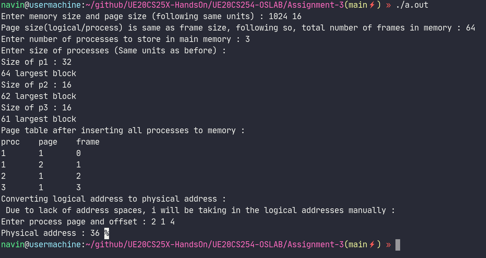
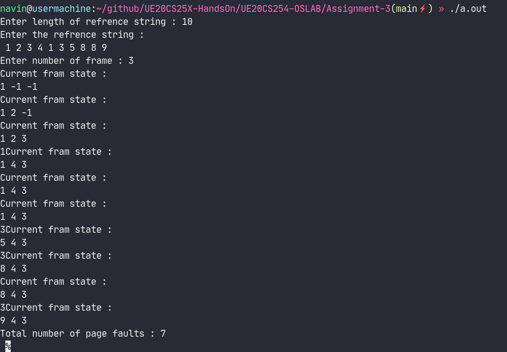

# OS lab submission-3

- **Name : P K Navin Shrinivas**
- **Section : D**
- **SRN : PES2UG20CS237**

## Program 1 : Simulate paging 

```C
lude<stdio.h> 
#include <stdlib.h> 


//GLOBAL VARS
int no_frames;

void insert_to_mem(int no_frame,int proc_size,int page_size,int* memory,int proc_number,int page_table[][no_frames]){
    //We also make page table entries in the same function
    int no_pages = proc_size/page_size;
    int j=0;
    while(j<no_pages){
        //paging give preference to contiguous storage and hence need to search for 
        //largest contiguous block available
        int starting = 0; //init starting address of contiguos block
        int ending = 0; //init ending address of contiguos block 
        int temp_starting = 0;
        int temp_ending = 0;
        int largest_size = 0;
        int temp_largest = 0;
        for(int i=0;i<no_frames;i++){
            if(memory[i] == 0){
                temp_largest+=1;
                temp_ending = i;
            }else{
                if(temp_largest > largest_size){
                    largest_size = temp_largest ;
                    starting = temp_starting;
                    ending = temp_ending;
                }
                temp_largest = 0; 
                temp_starting = i+1;
                temp_ending = i+1;
            }
        }
        if(temp_ending == no_frames-1){
            largest_size = no_frames-temp_starting;
            starting = temp_starting;
            ending = temp_ending;
        }
        printf("%d largest block \n",largest_size);
        if(largest_size >= no_pages){//we have large enuf blocs 
            for(int k=0;k<no_pages;k++){
                memory[starting]=1;
                page_table[proc_number][j+1] = starting;
                starting++;
                j++;
            }
        }else{
            printf("%d %d %d\n",starting,ending,no_pages);
            for(int k=0;k<largest_size;k++){
                memory[starting]=1;
                page_table[proc_number][j+1] = starting;
                starting++;
                j++;
            }
        }
    }
}


//Often times the programs online for paging is using a memory that stores the proc_number and its pages
//Instead here I have used a page table, where instead of maintaning PTBR for each process, I pseudo create one page table for each process.
int main(){
    int mem_size,page_size;
    printf("Enter memory size and page size (following same units) : ");
    scanf("%d %d",&mem_size,&page_size);
    no_frames = mem_size / page_size;
    int memory[no_frames];
    for(int i=0;i<no_frames;i++){
        memory[i] = 0;
    }

    printf("Page size(logical/process) is same as frame size, following so, total number of frames in memory : %d \n",no_frames);
    printf("Enter number of processes to store in main memory : ");
    int no_proc;
    scanf("%d",&no_proc);
    int page_table[no_proc+1][no_frames];
    //any given process can not take more than max number of frams (no_frames), that also means we dont need to keep page table entires of more than max frames for each proc.
    for(int i=0;i<no_proc+1;i++){
        for(int j=0;j<no_frames;j++){
            page_table[i][j] = -1;
        }
    }
    printf("Enter size of processes (Same units as before) : \n");
    for(int i=0;i<no_proc;i++){
        int proc_size;
        printf("Size of p%d : ",i+1);
        scanf("%d",&proc_size); 
        insert_to_mem(no_frames,proc_size,page_size,memory,i+1,page_table);
    }
    printf("Page table after inserting all processes to memory : \n");
    printf("proc\tpage\tframe\n");
    for(int i=0;i<no_proc;i++){
        for(int j=0;j<no_frames;j++){
            if(page_table[i+1][j]!=-1){
                printf("%d\t%d\t%d \n",i+1,j,page_table[i+1][j]);
            }
        }
    }
    printf("Converting logical address to physical address : \n ");
    printf("Due to lack of address spaces, i will be taking in the logical addresses manually : \n");
    int log_proc,log_page,offset;
    printf("Enter process page and offset : ");
    scanf("%d %d %d",&log_proc,&log_page,&offset);
    if(offset > page_size){
        printf("Wrong values! \n" );
        return 0;
    }
    if(log_proc > no_proc || log_proc == 0){
        printf("Wrong value! \n");
        return 0;
    }
    if(page_table[log_proc][log_page] == -1){
        printf("Invalid page! \n");
        return 0;
    }
    printf("Physical address : %d ",page_table[log_proc][log_page]*page_size+offset);
    //base address in this code is always 0 cus we are using only one memory!
}

```

**Screenshots :**



## Program 2 : Implement optimum page replacement

**code :**

```C
#include<stdio.h> 

int page_fault = 0;


void enter_page(int* ref,int page_number,int i,int n,int* frames,int f){
    //Before anything, have to check if page already in fram list 
    for(int j=0;j<f;j++){
        if(frames[j] == page_number)
            return;
    }
    
    page_fault++;
    //First check for a free place in the frames 
    for(int i=0;i<f;i++){
        if(frames[i] == -1){
            frames[i] = page_number;
            return;
        }
    }
    //If no free frames, need to find what to replace
    //Starting from current frame, see all the near by frames
    int non_replace_arr[f];
    for(int j=0;j<f;j++){
        non_replace_arr[j] = 0;
    }
    int left_replace=f;
    for(int j=i;j<n;j++){
        if(left_replace == 1){
            break;
        }
        for(int k=0;k<f;k++){
            if(frames[k] == ref[j]){
                non_replace_arr[k] = 1;
                if(left_replace == 1)
                    break;
                left_replace--;
            }
        }
    }
    printf("%d",left_replace);
    fflush(stdout);
    for(int j=0;j<f;j++){
        if(non_replace_arr[j]!=1){
            frames[j] = page_number ;
            break;
        }
    }
}

int main(){
    int ref[100];
    printf("Enter length of refrence string : ");
    int n;
    scanf("%d",&n);
    printf("Enter the refrence string : \n ");
    for(int i=0;i<n;i++)
        scanf("%d",&ref[i]);
    printf("Enter number of frame : ");
    int f;
    scanf("%d",&f);
    //keep all frame free initially thus -1 
    int frames[f];
    for(int i=0;i<f;i++){
        frames[i] = -1;
    }
    for(int i=0;i<n;i++){
        enter_page(ref,ref[i],i,n,frames,f);
        printf("Current fram state : \n");
        for(int j=0;j<f;j++){
            printf("%d ",frames[j]);
        }
        printf("\n");
    }

    printf("Total number of page faults : %d \n ",page_fault);
}
```

**Screenshots :**




**END OF ASSIGNMENT : PES2UG20CS237**
