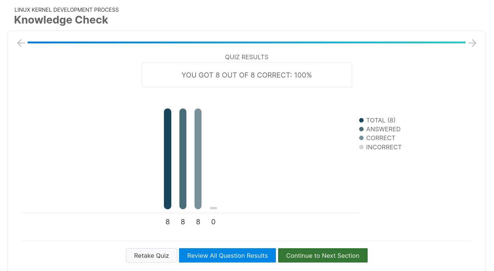
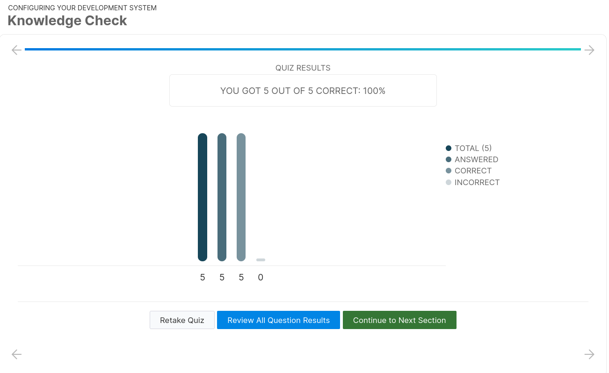
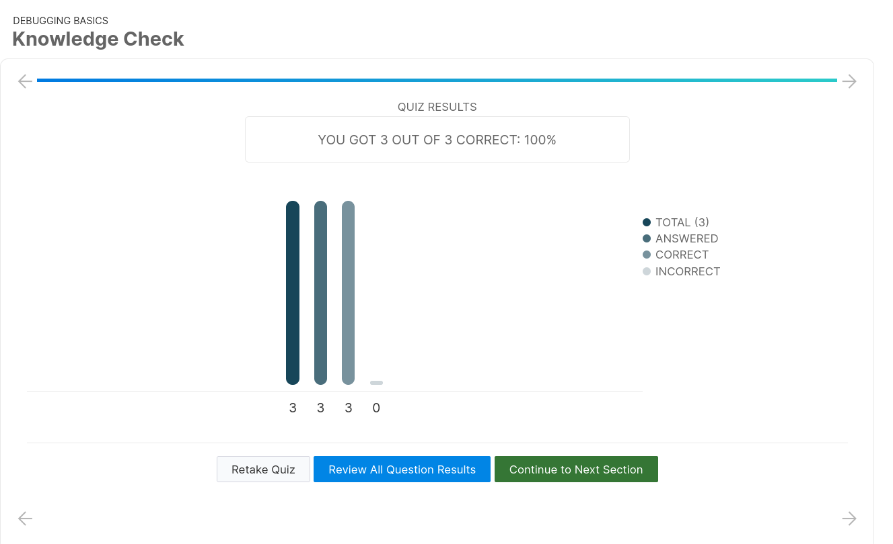
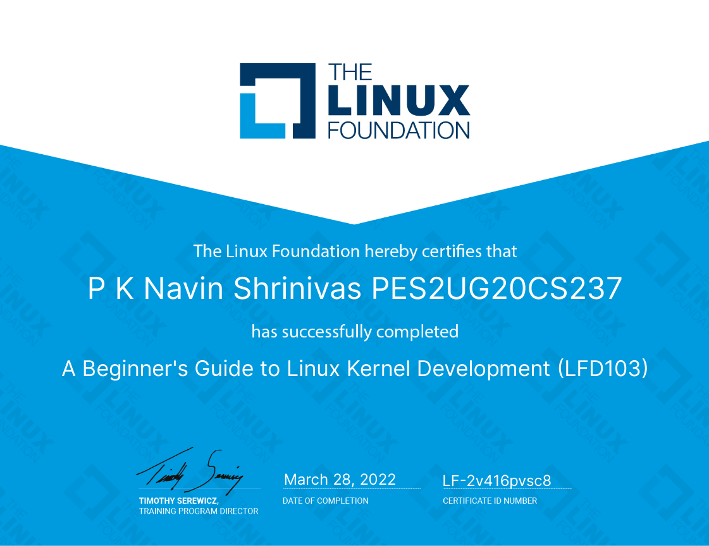

# LFD103 Linux  Foundation Course

- Name : P K Navin Shrinivas 
- Section : D 
- SRN : PES2UG20CS237

## Quiz results

**1st Quiz :**

**2nd Quiz :**

**3rd Quiz :**

**4th Quiz :**

**5th Quiz :**

**6th Quiz :**

**7th Quiz :**

**8th Quiz :**

**9th Quiz :**

**10th Quiz :**

**11th Quiz :**

**12th Quiz :**

## Certificate 

[link](https://ti-user-certificates.s3.amazonaws.com/e0df7fbf-a057-42af-8a1f-590912be5460/a893cdc0-53a5-47a2-8e90-8bbc5a78c4f3-p-k-navin-shrinivas-pes2ug20cs237-3caf3f9f-fc58-401e-bc64-7cf9228b07e8-certificate.pdf) to certificate

**Certificate :** 

**End of report/Document**

