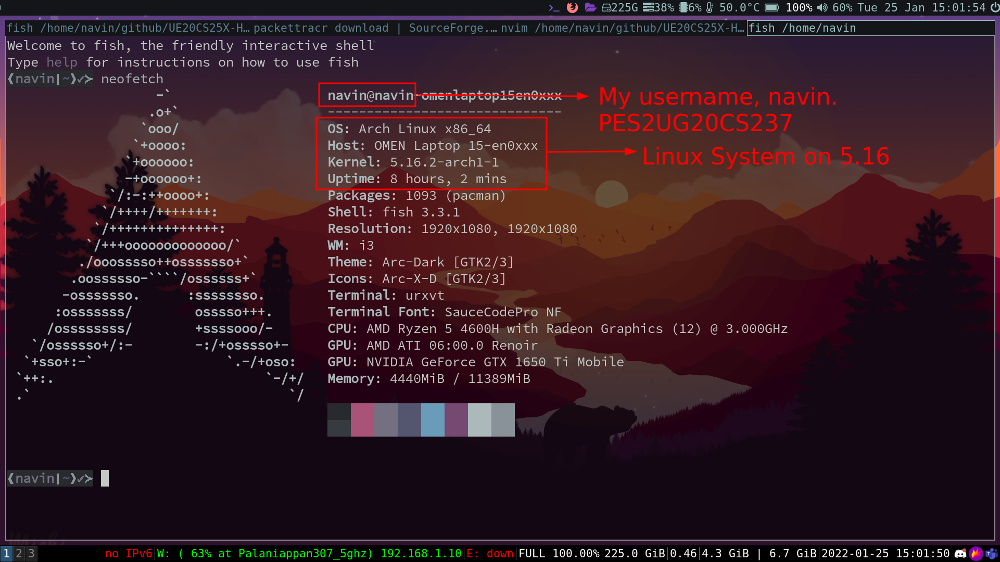
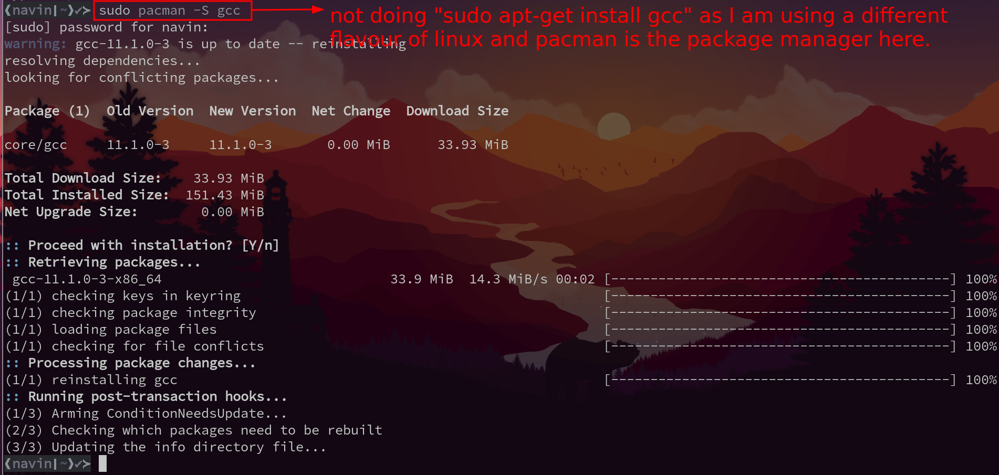
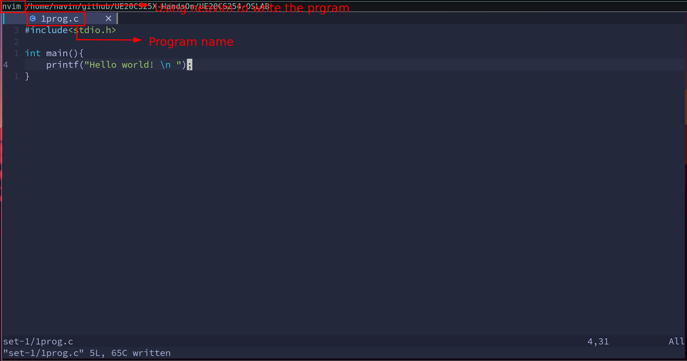
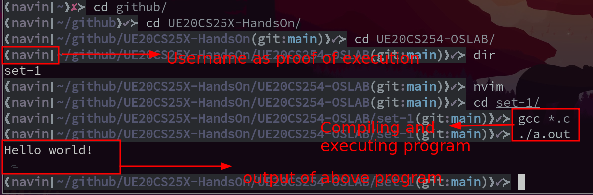
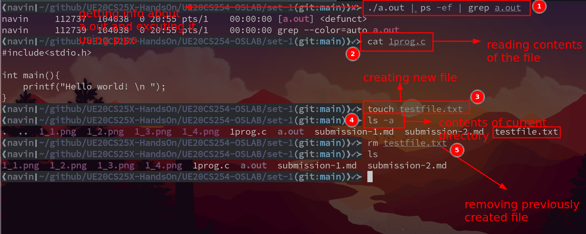

# OS Lab Week -1 

- Name : P K Navin Shrinivas
- Section : D
- SRN : PES2UG20CS237

## Task-1 : Create a Linux system 

I have not created a VM as I run linux as my main os, a screenshot showing the same is attached
below : 

## Task-2 : Installing C compiler

I am using a different flavour of linux called arch linux [As inditacted in previous screenshot].
Hence the package manager use is pacman instead of apt. Screenshot : 

## Task-3 : creation of sample program

Screenshots for writing[Using neovim(nvim) instead of vim],compiling and excution screenshots : 

## Task-4 : 5 linux shell commands 

