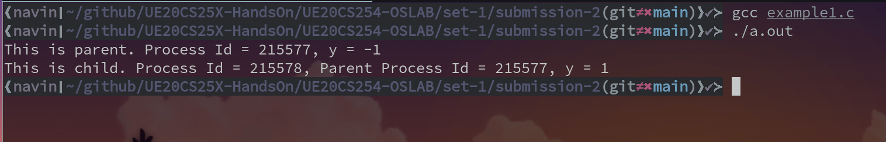
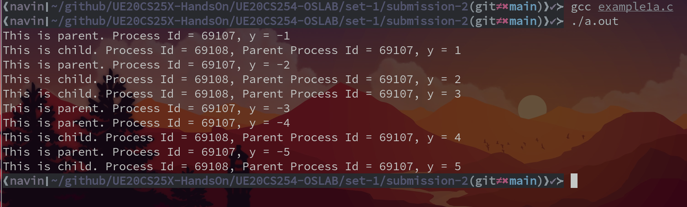
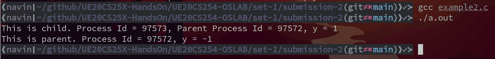
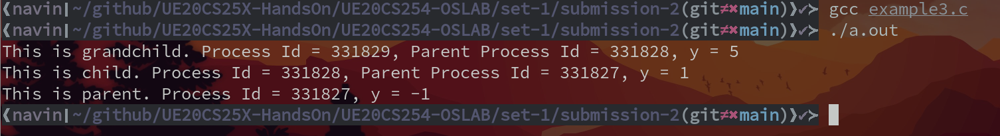
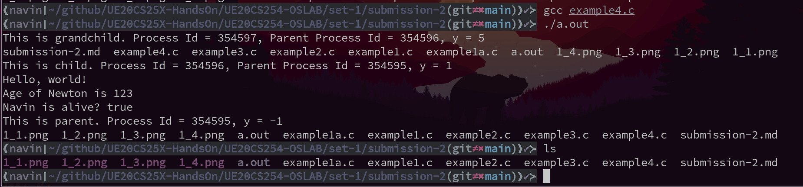

# OS Lab Week-2 

- Name : P K Navin Shrinivas
- Section : D
- SRN : PES2UG20CS237

## Program 1 : fork(), pid(), ppid()

In this program we first use fork for the first time, this is part of the unistd.h library
fork takes no parameters but returns conditionally, what do I mean by conditionally?

Negative Value: creation of a child process was unsuccessful.
Zero: Returned to the newly created child process.
Positive value: Returned to parent or caller. The value contains process ID of newly created child process.

more important things of fork function : 

**Important:** Parent process and child process are running the same program,
but it does not mean they are identical. OS allocate different data and
states for these two processes, and the control flow of these processes can
be different.

getpid() gets the process ID of the current process 
getppid() gets the process ID of the parent proces

**Screenshot :**

## Program 1a : 

we use the same functions as in program 1, no new functions. But this program better represents
how OS allocates the parents and child their seperate data and states.

**Screenshot :**

## Program 2 : wait(NULL)

wait(NULL) makes the parent wait for the exit status of child, now 2 cases are possible :

Child finishes before parent reaches wait(NULL): In such a case the child becomes a zombie 
proccess and waits for the parent process to read its exit status.

Child continues afte parent reached wait(NULL) : In this case the parent waits for the child
to return back a exit status.

wait(NULL) provides us programmer with a sure shot way of avoiding orphan process.

**Screenshot :** 

## Program 3 :

We use same functions as last program, no new functions. But here we make a grandchild, Figuring
out the order of outputs [due to wait(NULL)] along with number output proved to be challenging.

**Screenshots :**

## Program 4 : execl() execv() 

Both the functions are used to execute a file, In linux all commands are simply binary files
located in /bin/ ans often part of path.

execX() functions are usefull to execute these files.The manpages gives a very clear 
understanding of these two functions and their uses : 

execl : Used to execute a file where first argument is the path to the file, all other parameters
are arguments that need to to be passed to the file. These aguments need to be terminated with
NULL as per posix standards so that execl can know the end of arguments, which is seen in code
example with the last parameter being NULL.

execv : Used to execute files where the arguments are passed in a vector [in C, arrays], and
just like before the vector must be terminated with a NULL which is also seen in code when 
the only thing in array "a" is NULL, indicating no arguments.

also the -r parameter to execl is a flag being passed as argument to ls which tells ls to sort
output in reverse order 

**Screenshot :** 

