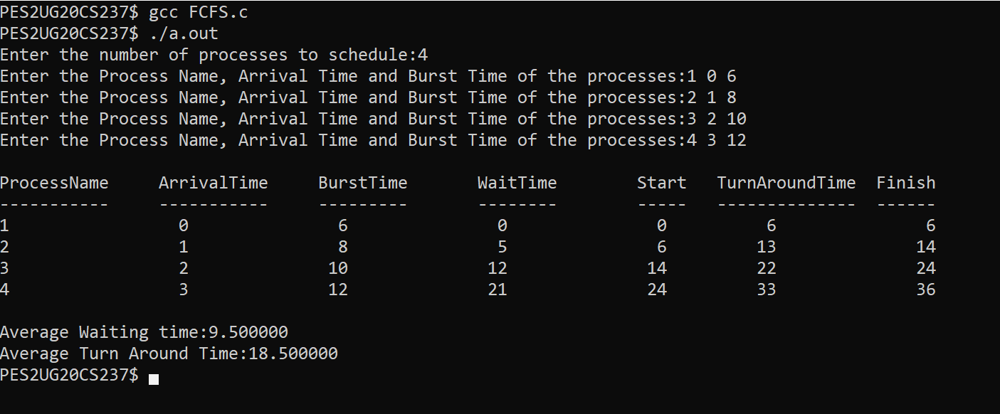
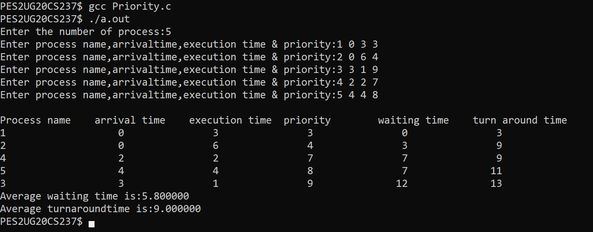
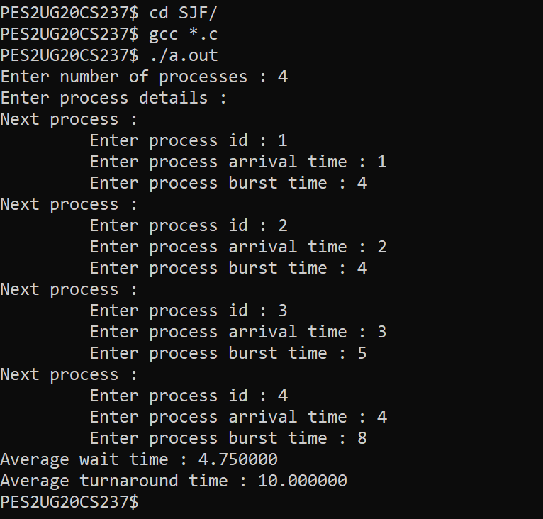
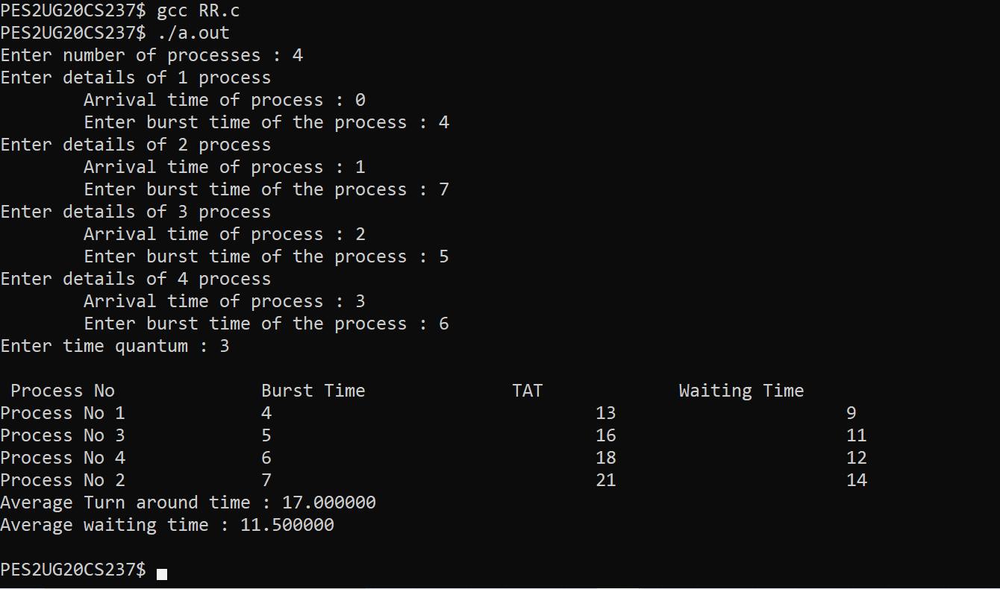

# OS lab submission-3 

- Name : P K Navin Shrinivas 
- Section : D 
- SRN : PES2UG20CS237

## Algorithm 1 : FCFS - First Come First Serve Scheduling

**Code :**

```c
//Program to demo "First Come First Serve" CPU scheduling

#include <stdio.h>
#include <string.h>

int main()
{
    char pn[10][10],t[10];
    int arr[10],bur[10],star[10],finish[10],tat[10],wt[10],i,j,n,temp;
    int totwt = 0, tottat = 0;

    printf("Enter the number of processes to schedule:");
    scanf("%d", &n);

    for (i = 0; i < n; i++)
    {
        printf("Enter the Process Name, Arrival Time and Burst Time of the processes:");
        scanf("%s %d %d", pn[i], &arr[i], &bur[i]);
    }

    for (i = 0; i < n; i++)
    {
        for (j = 0; j < n; j++)
        {
            if (arr[i] < arr[j])
            {
	       temp = arr[i];
	       arr[i] = arr[j];
	       arr[j] = temp;
	       temp = bur[i];
	       bur[i] = bur[j];
	       bur[j] = temp;
	       strcpy(t, pn[i]);
	       strcpy(pn[i],pn[j]);
	       strcpy(pn[j],t);
	    }
	}
    }

    for (i = 0; i < n; i++)
    {
        if (i == 0)
	   star[i] = arr[i];
        else
           star[i] = finish[i-1];

	wt[i]=star[i]-arr[i];
        finish[i]=star[i]+bur[i];
        tat[i]=finish[i]-arr[i];
    }

    printf("\nProcessName\tArrivalTime\tBurstTime\tWaitTime\tStart\tTurnAroundTime\tFinish");
    printf("\n-----------\t-----------\t---------\t--------\t-----\t--------------\t------");

    for (i = 0; i < n; i++)
    {
        printf("\n%s\t\t%3d\t\t%3d\t\t%3d\t\t%3d\t%6d\t\t%6d",pn[i],arr[i],bur[i],wt[i],star[i],tat[i],finish[i]);
        totwt += wt[i];
        tottat += tat[i];
    }

    printf("\n\nAverage Waiting time:%f",(float)totwt/n);
    printf("\nAverage Turn Around Time:%f\n",(float)tottat/n);
    return 0;
}

```

**Screenshots :**



## Algorithm 2 : Priority Scheduling 

**Code :**

```c
// Program to demo priority scheduling

#include <stdio.h>
#include <string.h>

int main() {
  int et[20], at[10], n, i, j, temp, p[10], st[10], ft[10], wt[10], ta[10];
  int totwt = 0, totta = 0;
  float awt, ata;
  char pn[10][10], t[10];

  printf("Enter the number of process:");
  scanf("%d", &n);
  for (i = 0; i < n; i++) {
    printf("Enter process name,arrivaltime,execution time & priority:");
    scanf("%s%d%d%d", pn[i], &at[i], &et[i], &p[i]);
  }
  for (i = 0; i < n; i++)
    for (j = 0; j < n; j++) {
      if (p[i] < p[j]) {
        temp = p[i];
        p[i] = p[j];
        p[j] = temp;
        temp = at[i];
        at[i] = at[j];
        at[j] = temp;
        temp = et[i];
        et[i] = et[j];
        et[j] = temp;
        strcpy(t, pn[i]);
        strcpy(pn[i], pn[j]);
        strcpy(pn[j], t);
      }
    }

  for (i = 0; i < n; i++) {
    if (i == 0) {
      st[i] = at[i];
      wt[i] = st[i] - at[i];
      ft[i] = st[i] + et[i];
      ta[i] = ft[i] - at[i];
    } else {
      st[i] = ft[i - 1];
      wt[i] = st[i] - at[i];
      ft[i] = st[i] + et[i];
      ta[i] = ft[i] - at[i];
    }

    totwt += wt[i];
    totta += ta[i];
  }

  awt = (float)totwt / n;
  ata = (float)totta / n;

  printf("\nProcess name\tarrival time\texecution time\tpriority\twaiting "
         "time\tturn around time");

  for (i = 0; i < n; i++)
    printf("\n%s\t\t%5d\t\t%5d\t\t%5d\t\t%5d\t\t%5d", pn[i], at[i], et[i], p[i],
           wt[i], ta[i]);

  printf("\nAverage waiting time is:%f", awt);
  printf("\nAverage turnaroundtime is:%f\n", ata);
}
```

**Screenshots :**



## Algorithm 3 : SJFP - Shortest Job first Preemptive

**Code :**

main.c :

```
#include "SJF_Preemptive.h"

int main() {
  int n;
  printf("Enter number of processes : ");
  scanf("%d", &n);
  proc_t *list[1024] = {NULL}; // initially no process in the list
  exec_t *exec_list[1024] = {NULL};
  fetch_proc(list, n); // fetches processes from the user with ID checks
  exec_proc(list, exec_list, n);
  print(n, exec_list);
  return 0;
}
```

SJF_Preemptive.h :

```c
#ifndef SJF_H
#define SJF_H
#include <stdbool.h>
#include <stdio.h>
#include <stdlib.h>

struct proc {
  int id_;
  int burst_;
  int copy_;
  int arrival_;
};
struct executed {
  int wait_;
  int tat_; // tat : turn around time
  int end_;
};

typedef struct executed exec_t;
typedef struct proc proc_t;

void fetch_proc(proc_t **list, int n);
void exec_proc(proc_t **list, exec_t **exec_list, int n);
void print(int n, exec_t **exec_list);
#endif
```

SJF_Preemptive_1.c : 


```c
#include "SJF_Preemptive.h"
#include <stdio.h>

void fetch_proc(proc_t **list, int n) {
  printf("Enter process details : \n");
  for (int i = 0; i < n; i++) {

    printf("Next process : \n");
    printf("\t Enter process id : ");
    int c;
    scanf("%d", &c);
    bool present = false; // for avoiding breaks in C code.
    for (int j = 0; j < 1024; j++) {
      if (list[j] != NULL &&
          list[j]->id_ == c) { // NULL condition due to seg faults
        printf("\n Process with same ID has already arrived! \n");
        printf("previous input discarded! \n");
        printf(
            "If you want to enter a dummy process enter burst time as 0 \n \n");
        present = true;
      }
    }

    if (!present) {
      list[i] = (proc_t *)malloc(sizeof(proc_t));
      list[i]->id_ = c;
      printf("\t Enter process arrival time : ");
      scanf("%d", &(list[i]->arrival_));
      printf("\t Enter process burst time : ");
      scanf("%d", &(list[i]->burst_));
      list[i]->copy_ = list[i]->burst_;
    } else {
      i--; // to make sure there is not empty gaps in the array
    }
  }
}

void exec_proc(proc_t **list, exec_t **exec_list, int n) {
  /*
   *- wait time : time of arrival to the time the CPU burst were given
   *- turnaround time : time of arrival to time of completion
   */

  list[1023] = (proc_t *)malloc(sizeof(proc_t));
  int count = 0; // keeps track of number of proc's coimpleted
  for (int time = 1; count != n; time++) {
    // find the shortest job arriving at or before the present time.
    int smallest = 1023; // if no job found at a given time it will remain 1023
    list[1023]->burst_ = 99999;
    for (int i = 0; i < n; i++) {
      if (list[i] != NULL) {
        if (list[i]->arrival_ <= time &&
            list[i]->burst_ <= list[smallest]->burst_ && list[i]->burst_ > 0) {

          smallest = i;
        }
      }
    }
    list[smallest]->burst_--;
    if (list[smallest]->burst_ == 0) { // process is complete, calculate now
      count++;
      exec_list[smallest] = (exec_t *)malloc(sizeof(exec_t));
      exec_list[smallest]->end_ = time + 1;
      exec_list[smallest]->wait_ = exec_list[smallest]->end_ -
                                   list[smallest]->arrival_ -
                                   list[smallest]->copy_;
      exec_list[smallest]->tat_ =
          exec_list[smallest]->end_ - list[smallest]->arrival_;
    }
  }
}

void print(int n, exec_t **exec_list) {
  double wait_sum = 0.0;
  double tat_sum = 0.0;
  for (int i = 0; exec_list[i] != NULL; i++) {
    wait_sum += exec_list[i]->wait_;
    tat_sum += exec_list[i]->tat_;
  }
  printf("Average wait time : %f \n", wait_sum / n);
  printf("Average turnaround time : %f \n", tat_sum / n);
}
```

**Screenshots :** 



## Algorithm 4 : RR - Round Robin Scheduling

**Code :**

```c
// Program to show working of Preemptive Round Robin scheduling Algorithm

#include <stdio.h>
#include <stdlib.h>

struct proc {
  int id_;
  int arrival_;
  int burst_;
  int copy_;
  int end_;
};
typedef struct proc proc_t;

int main() {
  int n;
  printf("Enter number of processes : ");
  scanf("%d", &n);
  proc_t *proc_list[1024] = {NULL};
  for (int i = 0; i < n; i++) {
    proc_list[i] = (proc_t *)malloc(sizeof(proc_t));
    printf("Enter details of %d process \n", i + 1);
    printf("\tArrival time of process : ");
    scanf("%d", &(proc_list[i]->arrival_));
    printf("\tEnter burst time of the process : ");
    scanf("%d", &(proc_list[i]->burst_));
    proc_list[i]->copy_ = proc_list[i]->burst_;
    proc_list[i]->id_ = i + 1;
  }
  int quantum;
  printf("Enter time quantum : ");
  scanf("%d", &quantum);

  // sorting wtr to arrival time
  for (int i = 0; i < n - 1; i++) {
    for (int j = 0; j < n - i - 1; j++) {
      if (proc_list[j]->arrival_ > proc_list[j + 1]->arrival_) {
        proc_t *temp = proc_list[i];
        proc_list[i] = proc_list[i + 1];
        proc_list[i + 1] = temp;
      }
    }
  }
  // unlike most algorithms, I'll actually move the jobs to the last
  int count = 0;
  int move_to = n;
  for (int time = 0; count < n;) {
    int fon = 0;
    for (int j = 0; j < move_to; j++) {
      if (proc_list[j]) {
        if (proc_list[j]->arrival_ <= time && proc_list[j]->burst_ > 0) {
          fon = 1;
          if (proc_list[j]->burst_ <= quantum) {
            time += proc_list[j]->burst_;
            proc_list[j]->burst_ = 0;
            proc_list[j]->end_ = time;
            count++;
          } else if (proc_list[j]->burst_ > 0) {
            proc_list[j]->burst_ -= quantum;
            time += quantum;
            proc_t *move = proc_list[j];
            proc_list[j] = NULL;
            proc_list[move_to] = move;
            move_to++;
          }
        }
      }
    }
    if (!fon)
      time++;
  }

  // printing all the stuff
  int tot_tat = 0, tot_wt = 0;
  printf("\n Process No \t\t Burst Time \t\t TAT \t\t Waiting Time ");
  for (int i = 0; i < move_to; i++) {
    if (proc_list[i]) {
      int tat = proc_list[i]->end_ - proc_list[i]->arrival_;
      int wt = tat - proc_list[i]->copy_;
      tot_tat += tat;
      tot_wt += wt;
      printf("\nProcess No %d \t\t %d\t\t\t\t %d\t\t\t %d", proc_list[i]->id_,
             proc_list[i]->copy_, tat, wt);
    }
  }
  printf("\nAverage Turn around time : %f \n", tot_tat / (n + 0.0));
  printf("Average waiting time : %f \n", tot_wt / (n + 0.0));
  printf("\n");
}

```

**Screenshots :**


