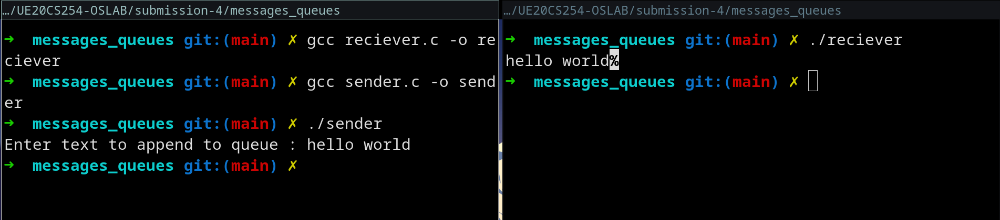
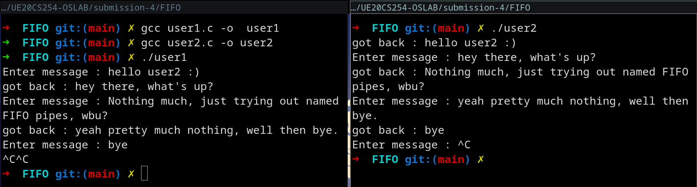

# OS lab submission-4

- Name : P K Navin Shrinivas 
- Section : D 
- SRN : PES2UG20CS237

## Program 1 : Message Queues

**sender code :**

```C
#include <stdio.h>
#include <sys/ipc.h>
#include <sys/msg.h>
#include <sys/types.h>
#include <unistd.h>

struct my_msgbuf {
  long mtype;
  char mtext[200];
};

int main() {
  int msgid = msgget(ftok("haloo", 65), 0777);
  // ftok gets us a unique ID for our message queues
  // 0777 id the read write permissions for the queue
  struct my_msgbuf msg;
  printf("Enter text to append to queue : ");
  scanf("%[^\n]*c", msg.mtext);
  msg.mtype = 1; // must, can be 0 or greater
  msgsnd(msgid, &msg, sizeof(msg), 0);
  // msgsend ofc sends the message :)
}
```
**rcv code :**

```C
#include <stdio.h>
#include <sys/ipc.h>
#include <sys/msg.h>
#include <sys/types.h>
#include <unistd.h>
struct my_msgbuf {
  long mtype;
  char mtext[200];
};

int main() {
  struct my_msgbuf msg;
  int msgid = msgget(ftok("haloo", 65), 0777);
  char output[1000];
  msgrcv(msgid, &msg, sizeof(msg), 1, 0);
  // message rcv revices all the messages of type 1
  printf("%s", msg.mtext);
}
```


**Screenshots :**




## Program 2 : FIFO-named pipes

**user1 code :**

```C
// This is a 2 pipe, only rcv from one side and send from both sides
// send side
#include <fcntl.h>
#include <stdbool.h>
#include <stdio.h>
#include <string.h>
#include <sys/stat.h>
#include <unistd.h>
int main() {
  int fd;
  char *file = "/home/navin/hello";
  mkfifo(file, 0777);
  while (true) {
    fd = open(file, O_WRONLY);
    char input[80];
    printf("Enter message : ");
    fflush(stdout);
    scanf("\t%[^\n]c", input);
    write(fd, input, strlen(input) + 1);
    close(fd);

    fd = open("/home/navin/hello", O_RDONLY);
    char output[80];
    read(fd, output, sizeof(output));
    printf("got back : %s \n", output);
    close(fd);
  }
}
```
**user2 code :**

```C
#include <sys/ipc.h>
#include <sys/msg.h>
#include <sys/types.h>
#include <unistd.h>
struct my_msgbuf {
  long mtype;
  char mtext[200];
};

int main() {
  struct my_msgbuf msg;
  int msgid = msgget(ftok("haloo", 65), 0777);
  char output[1000];
  msgrcv(msgid, &msg, sizeof(msg), 1, 0);
  // message rcv revices all the messages of type 1
  printf("%s", msg.mtext);
}
```


**Screenshots :**


