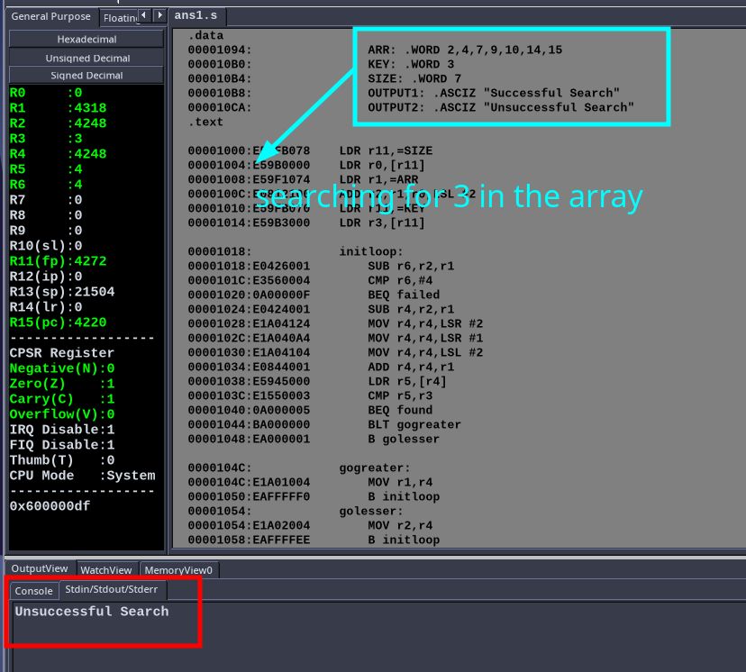
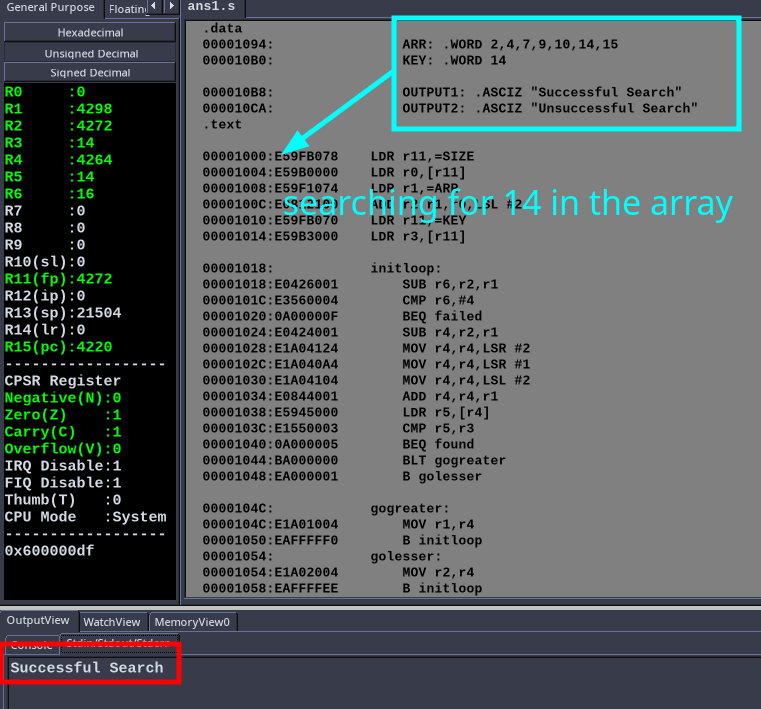
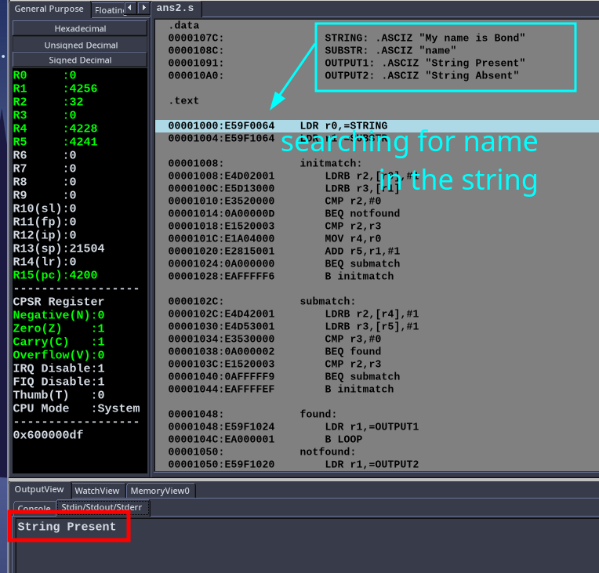
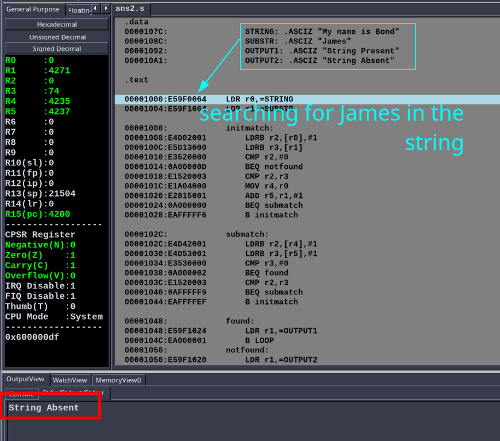

# MPCA Assignment : Unit-2

- Name : P K Navin Shrinivas 
- Section : D 
- SRN : PES2UG20CS237 

##  Question 1: Binary Search in ARM7RDMI Assembly 

**Code:** 

```assembly 
.data
    ARR: .WORD 2,4,7,9,10,14,15
    KEY: .WORD 14
    SIZE: .WORD 7
    OUTPUT1: .ASCIZ "Successful Search"
    OUTPUT2: .ASCIZ "Unsuccessful Search"
.text

LDR r11,=SIZE
LDR r0,[r11]
LDR r1,=ARR
ADD r2,r1,r0,LSL #2
LDR r11,=KEY
LDR r3,[r11]

initloop:
    SUB r6,r2,r1 
    CMP r6,#4
    BEQ failed
    SUB r4,r2,r1
    MOV r4,r4,LSR #2
    MOV r4,r4,LSR #1
    MOV r4,r4,LSL #2
    ADD r4,r4,r1
    LDR r5,[r4]
    CMP r5,r3
    BEQ found
    BLT gogreater
    B golesser

gogreater:
    MOV r1,r4
    B initloop
golesser:
    MOV r2,r4
    B initloop
found:
    ldr r1,=OUTPUT1 
    B LOOP
failed:
    ldr r1,=OUTPUT2
    B LOOP

LOOP:
    LDRB R0,[R1],#1 
    CMP R0,#0 
    SWINE 0x00 
    BNE LOOP 
    SWI 0x11      

end: .end
```

**Screenshots:**





##  Question 2 : Search for a substring in a string using ARM7TDMI

**Code:** 

```assembly 
.data 
    STRING: .ASCIZ "My name is Bond"
    SUBSTR: .ASCIZ "name"
    OUTPUT1: .ASCIZ "String Present"
    OUTPUT2: .ASCIZ "String Absent"

.text 

LDR r0,=STRING
LDR r1,=SUBSTR 

initmatch:
    LDRB r2,[r0],#1
    LDRB r3,[r1]
    CMP r2,#0 
    BEQ notfound
    CMP r2,r3
    MOV r4,r0
    ADD r5,r1,#1
    BEQ submatch
    B initmatch 

submatch:
    LDRB r2,[r4],#1
    LDRB r3,[r5],#1 
    CMP r3,#0 
    BEQ found 
    CMP r2,r3
    BEQ submatch
    B initmatch

found:
    LDR r1,=OUTPUT1
    B LOOP
notfound:
    LDR r1,=OUTPUT2
    B LOOP 

LOOP:
    LDRB R0,[R1],#1 
    CMP R0,#0 
    SWINE 0x00 
    BNE LOOP 
    SWI 0x11   

```

**Screenshots:**





