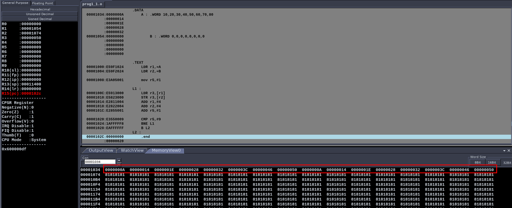

# Week-3 MPCA Lab 

## Program 1A : move block of data from one memory to another memory location

**Code :**


```asm
.DATA
    A : .WORD 10,20,30,40,50,60,70,80
	B : .WORD 0,0,0,0,0,0,0,0

.TEXT
    LDR r1,=A
    LDR r2,=B

    mov r5,#1

L1 : 
    LDR r3,[r1]
    STR r3,[r2]
    ADD r1,#4
    ADD r2,#4
    ADD r5,#1

    CMP r5,#9
    BNE L1
    B L2
L2 : 
    .end
```

**Screenshots :**



## Program 2 : Write a program to find sun of N data items in the memory

- Store the result in memory 
- Use full word
- Use half word 
- Use byte words

> Note: I have implemented all three in a single program.

**Code :**

```asm
.DATA 
   A : .WORD 10,20,30,40,50
   B : .HWORD 10,20,30,40,50
   C : .byte 10,20,30,40,50

.TEXT 
    LDR r1,=A
    LDR r2,=B 
    LDR r3,=C
    LDR r9,=C 

    ADD r9,r9,#6

    mov r4,#0
    mov r5,#0
    mov r6,#0
    mov r7,#0
L1 :
        LDR r8,[r1]
        ADD r5,r5,r8
        ADD r1,#4

        ADD r4,#1
        CMP r4,#5
        BNE L1
        STR r5,[r9]
        ADD r9,#4
        mov r4,#0

L2 : 
        LDRH r8,[r2]
        ADD r6,r6,r8
        ADD r2,#2

        ADD r4,#1
        CMP r4,#5
        BNE L2
        STR r6,[r9]
        ADD r9,#4
        mov r4,#0

L3 :
        LDRB r8,[r3]
        ADD r7,r7,r8
        ADD r3,#1

        ADD r4,#1
        CMP r4,#5
        BNE L3
        STR r7,[r9]
        ADD r9,#4
        B L4

L4 : .end
```

**Screenshots :**


## Program 3 : Write a program to find sum of N numbers

- Store the result in any memory location.

**Code :**
```asm
.DATA
    A : .WORD 16

.TEXT
    LDR r5,=A
    LDR r0,[r5]
    mov r1,#1 
    mov r2,#0 

L1 : 
    ADD r2,r2,r1
    ADD r1,#1

    CMP r1,r0
    BNE L1
    ADD r5,#4
    STR r2,[r5]
    B L2 
L2 : .end
```
**Screenshots :**


## Program 5 : Convert the following C code to ARM7TDMI asm

**C code :**
```c 
if(A==B) C=A+B;
else if(B == C) D=A-B
else E = A*B
```

where A,B,C are memory locations.

**Code :**
```asm
.DATA
    A : .WORD 30
    B : .WORD 40
    C : .WORD 50
    D : .WORD 0
    E : .WORD 0

.TEXT
    LDR r0,=A
    LDR r1,=B
    LDR r2,=C
    LDR r11,=C
    LDR r3,=D 
    LDR r4,=E

    LDR r5,[r0]
    LDR r6,[r1]
    LDR r7,[r2]


    CMP r5,r6
    BEQ L2
    CMP r6,r7
    BEQ L3
    B L4

L2 :
    ADD r10,r5,r6
    STR r10,[r11]
    B L5
L3 :
    SUB r10,r5,r6
    STR r10,[r3]
    B L5
L4 :
    MUL r10,r5,r6
    STR r10,[r4]
    B L5

L5 : .end
```

**Screenshots :**

