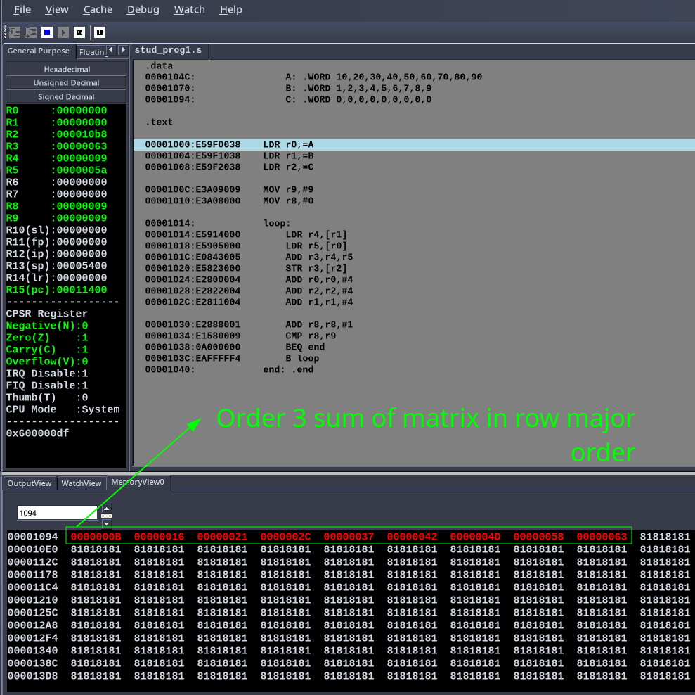
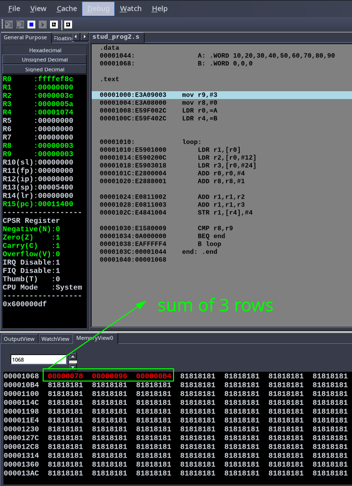
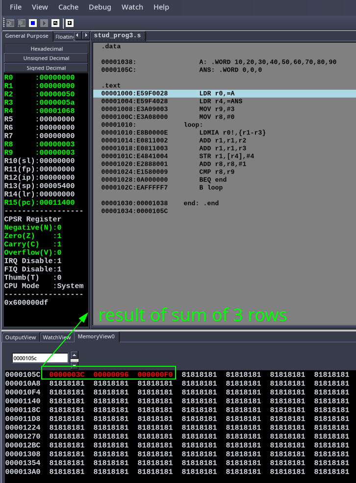

# MPCA Lab - Week 5 

- Name : P K Navin Shrinivas 
- Section : D 
- SRN : PES2UG20CS237 

## Student programs : 

###  Program 1: Add 2 matrices of order 3, i.e implement c[i][j] = a[i][j]+b[i][j] 

**Code:** 

```assembly 
.data
    A: .WORD 10,20,30,40,50,60,70,80,90
    B: .WORD 1,2,3,4,5,6,7,8,9
    C: .WORD 0,0,0,0,0,0,0,0,0

.text

LDR r0,=A
LDR r1,=B 
LDR r2,=C

MOV r9,#9
MOV r8,#0

loop:
    LDR r4,[r1]
    LDR r5,[r0]
    ADD r3,r4,r5
    STR r3,[r2]
    ADD r0,r0,#4
    ADD r2,r2,#4
    ADD r1,r1,#4

    ADD r8,r8,#1
    CMP r8,r9
    BEQ end 
    B loop 
end: .end
```

**Screenshots:**




###  Program 2: Find norm of a 3rd order matrix

**Code:** 

```assembly 
.data
    A: .WORD 10,20,30,40,50,60,70,80,90
    B: .WORD 0,0,0
    ANS: .WORD 0

.text

mov r9,#3
mov r8,#0
LDR r0,=A
LDR r4,=B


loop:
    LDR r1,[r0]
    LDR r2,[r0,#12]
    LDR r3,[r0,#24]
    ADD r0,r0,#4
    ADD r8,r8,#1

    ADD r1,r1,r2
    ADD r1,r1,r3
    STR r1,[r4],#4

    CMP r8,r9
    BEQ end 
    B loop 
end:
    CMP r1,r2
    BGT R1
    .end
 ```

**Screenshots:**



###  Program 3: Find sum of rows of a 3rd order matrix 

**Code:** 

```assembly 
.data

    A: .WORD 10,20,30,40,50,60,70,80,90
    ANS: .WORD 0,0,0

.text
    LDR r0,=A
    LDR r4,=ANS
    MOV r9,#3
    MOV r8,#0 
loop:
    LDMIA r0!,{r1-r3}    
    ADD r1,r1,r2
    ADD r1,r1,r3
    STR r1,[r4],#4
    ADD r8,r8,#1
    CMP r8,r9 
    BEQ end 
    B loop 

end: .end 
```

**Screenshots:**



