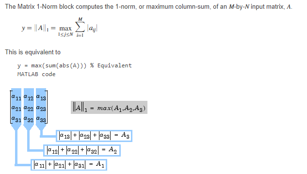

# Session-5 MPCA LAB : 

## Lab Program 

- To generate Fibbonacci series and store in array 
- Find smallest number in  an array 
- To multiply 2 arrays : c[][] = c[][] + (a[][]*b[][]), NOT COMPLETE
  - Using MLA 
  - Using MUL 
- Transfer a block of 256 words stored in location X to location y using Load Multiple and Store Multiple. Rate of transfer should be 32 bytes : 4 Words. 

## Student programs : 

- Add 2 matrices of order 3, i.e implement c[i][j] = a[i][j]+b[i][j]
  - Sum of two 3rd order matrix in row major is literally sum of the respective elements
- Write an assembly code to find the norm of of a square matrix
  -  
  - second element of the col is 12 bytes away
  - third is 24 bytes away, ofc these two are for 3 by 3 matrices only, ie n*4 bytes
- Write a program to find the row sum of a matrix
