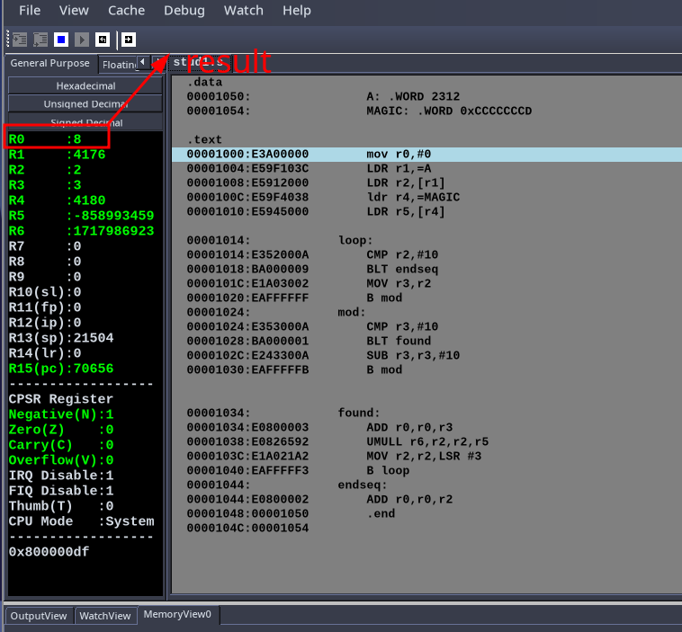
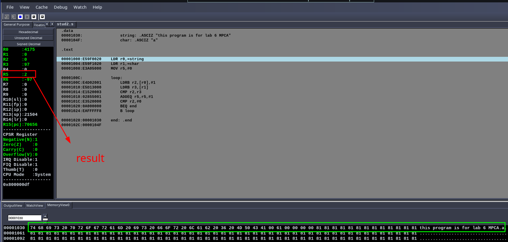
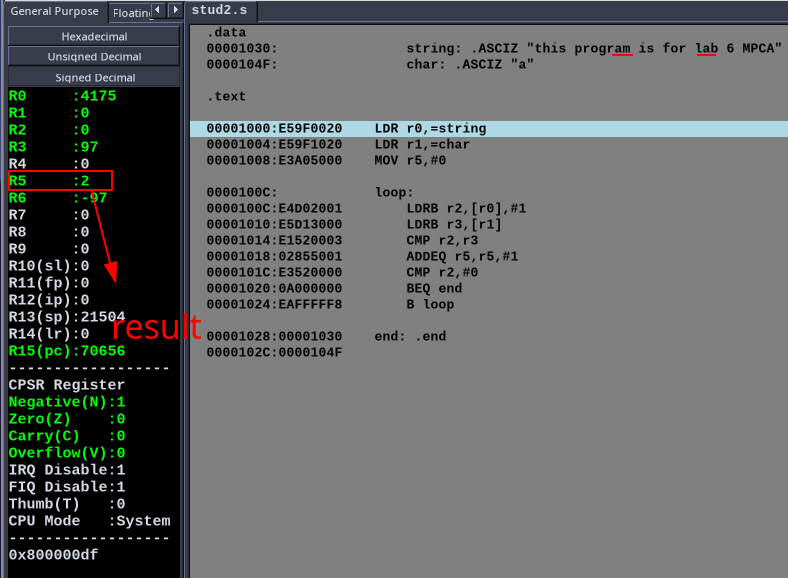

# MPCA Lab - Week 6

- Name : P K Navin Shrinivas 
- Section : D 
- SRN : PES2UG20CS237 

## Student programs : 

###  Program 1: Sum of all digits in a number 

**Code:** 

```assembly 
.data
    A: .WORD 2312
    MAGIC: .WORD 0xCCCCCCCD

.text
    mov r0,#0
    LDR r1,=A 
    LDR r2,[r1]
    ldr r4,=MAGIC
    LDR r5,[r4]

loop:
    CMP r2,#10
    BLT endseq
    MOV r3,r2
    B mod
mod:
    CMP r3,#10
    BLT found
    SUB r3,r3,#10
    B mod


found:
    ADD r0,r0,r3
    UMULL r6,r2,r2,r5
    MOV r2,r2,LSR #3
    B loop
endseq: 
    ADD r0,r0,r2
    .end
```

**Screenshots:**




###  Program 2: Find # of occurrence of an alphabet in a given string

**Code:** 

```assembly 
.data
    string: .ASCIZ "this program is for lab 6 MPCA"
    char: .ASCIZ "a"

.text

LDR r0,=string 
LDR r1,=char 
MOV r5,#0

loop:
    LDRB r2,[r0],#1
    LDRB r3,[r1]
    CMP r2,r3
    ADDEQ r5,r5,#1
    CMP r2,#0
    BEQ end
    B loop

end: .end 
```

**Screenshots:**





