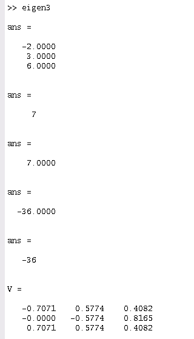
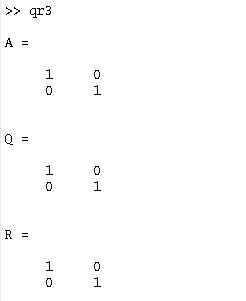
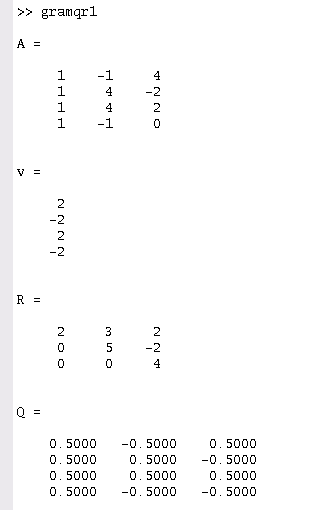
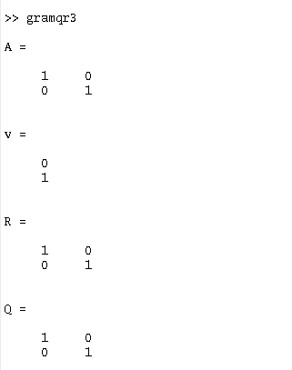
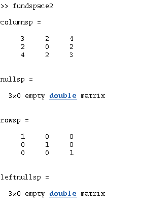

> Note : No semicolon means print

## 1 - Eigenvalues and Eigenvectors (Inbuilt)

**Preface :**

The `eig` function in matlab can be used to get Eigenvalues and Eigenvectors.

**Questions :**

Find the Eigenvalues and Eigenvectors for the following matrices : 

1. A=[3,1;0,3]

**Code :**
```js
A=[3,1;0,3];
eig(A)
% for verifying results : trace(A) = sum(eig(A)) and prod(eig(A)) = det(A)
trace(A)
sum(eig(A))
% 
prod(eig(A))
det(A)
% eig return eigen vectors as well 
[V,D]=eig(A);
V
```

**Screenshots :**


2. A=[1,2,3;4,5,6;0,0,0]

**Code :**
```js
A=[1,2,3;4,5,6;0,0,0];
eig(A)
% for verifying results : trace(A) = sum(eig(A)) and prod(eig(A)) = det(A)
trace(A)
sum(eig(A))
% 
prod(eig(A))
det(A)
% eig return eigen vectors as well 
[V,D]=eig(A);
V
```

**Screenshots :**


3. A=[1,1,3;1,5,1;3,1,1]

**Code :**
```js
A=[1,1,3;1,5,1;3,1,1];
eig(A)
% for verifying results : trace(A) = sum(eig(A)) and prod(eig(A)) = det(A)
trace(A)
sum(eig(A))
% 
prod(eig(A))
det(A)
% eig return eigen vectors as well 
[V,D]=eig(A);
V
```

**Screenshots :**

 


## 2 - Projection matrices and least squared method (Inbuilt)

**Preface :**

- projection can be found using `lsqr` function in matlab
- Projection matrices can be found using : a*transpose(a)/transpose(a)*a 
- `lsqr` is also used for finding least square 

**Questions :**

1. Find projection of b on A given, A=[1,0;0,1;1,1], b=[1,3,4]

**Code :**
```js
A=[1,0;0,1;1,1];
b=[1;3;4];
lsqr(A,b)
```

**Screenshots :**

 

2. find the projection a given,A=[1,0,0;0,1,0;0,0,1]

**code :**
```js
A=[1,0,0;0,1,0;0,0,1];
(A*transpose(A))/(transpose(A)*A)
```

**screenshots :**

 

3. find the least square fit for the following equations : 
  X+2Y=3
  3X+2Y=5
  X+Y=2.09

**code :**
```js
A=[1,2;3,2;1,1];
b=[3;5;2.09];
lsqr(A,b)
```

**screenshots :**

 


## 3 - QR Factorisation (Inbuilt)

**Preface :**

- Any matrix can be factorised into Q and R using `qr` function in matlab 

**Questions :**

Find the QR factors for the following : 

1. A=[1,-1,4;1,4,-2;1,4,2;1,-1,0]

**Code :**
```js
A=[1,-1,4;1,4,-2;1,4,2;1,-1,0];
[Q,R]=qr(A);
Q
R
```

**Screenshots :**

 

2. A=[3,2,4;2,0,2;4,2,3]

**code :**
```js
A=[1,0,0;0,1,0;0,0,1];
[Q,R]=qr(A);
Q
R
```

**screenshots :**

 

2. A=[1,0;0,1]

**code :**
```js
A=[1,0;0,1]
[Q,R]=qr(A);
Q
R
```

**screenshots :**

 


## 4 - QR Factorisation Using Gram-Schmidt process (Not Inbuilt)

**Preface :**

- here we factorise the matrices without using the qr command

**Questions :**

Find the QR factors for the following : 

1. A=[1,-1,4;1,4,-2;1,4,2;1,-1,0]

**Code :**
```js
A=[1,-1,4;1,4,-2;1,4,2;1,-1,0]
Q=zeros(3);
R=zeros(3);
for j=1:3
  v=A(:,j);
  for i=1:j-1
    R(i,j)=Q(:,i)'*A(:,j);
    v=v-R(i,j)*Q(:,i);
  end
  R(j,j)=norm(v);
  Q(:,j)=v/R(j,j);
end
v
R
Q
```

**Screenshots :**

 

2. A=[3,2,4;2,0,2;4,2,3]

**code :**
```js
A=[3,2,4;2,0,2;4,2,3]
Q=zeros(3);
R=zeros(3);
for j=1:3
  v=A(:,j);
  for i=1:j-1
    R(i,j)=Q(:,i)'*A(:,j);
    v=v-R(i,j)*Q(:,i);
  end
  R(j,j)=norm(v);
  Q(:,j)=v/R(j,j);
end
v
R
Q
```

**screenshots :**

 

3. A=[1,0;0,1]

**code :**
```js
A=[1,0;0,1]
Q=zeros(2);
R=zeros(2);
for j=1:2
  v=A(:,j);
  for i=1:j-1
    R(i,j)=Q(:,i)'*A(:,j);
    v=v-R(i,j)*Q(:,i);
  end
  R(j,j)=norm(v);
  Q(:,j)=v/R(j,j);
end
v
R
Q
```

**screenshots :**

 

## 5 - Gauss Jordan method of finding inverses (Not inbuilt)

**Preface :** 

- We can find inverses of matrices using Gauss Jordan method

**Problems :** 

Find inverses of the following matrices : 

1. A=[1,-1,4;1,4,-2;1,4,2]

**Code :**
```js
A=[1,-1,4;1,4,-2;1,4,2]
n = length(A(1,:));
Aug = [A,eye(n,n)]
for j=1:n-1
    for i=j+1:n
        Aug(i,j:2*n) = Aug(i,j:2*n)-Aug(i,j)/Aug(j,j)*Aug(j,j:2*n);
    end
end
for j=n:-1:2
    Aug(1:j-1,:) = Aug(1:j-1,:)-Aug(1:j-1,j)/Aug(j,j)*Aug(j,:);
end
for j=1:n
    Aug(j,:) = Aug(j,:)/Aug(j,j);
end
B=Aug(:,n+1:2*n)
```

**Screenshots :**

 

2. A=[3,2,4;2,0,2;4,2,3]

**code :**
```js
A=[3,2,4;2,0,2;4,2,3]
Aug = [A,eye(n,n)]
for j=1:n-1
    for i=j+1:n
        Aug(i,j:2*n) = Aug(i,j:2*n)-Aug(i,j)/Aug(j,j)*Aug(j,j:2*n);
    end
end
for j=n:-1:2
    Aug(1:j-1,:) = Aug(1:j-1,:)-Aug(1:j-1,j)/Aug(j,j)*Aug(j,:);
end
for j=1:n
    Aug(j,:) = Aug(j,:)/Aug(j,j);
end
B=Aug(:,n+1:2*n)
```

**screenshots :**

 

3. A=[1,0,0;0,1,0;0,0,1]

**code :**
```js
A=[1,0,0;0,1,0;0,0,1]
Aug = [A,eye(n,n)]
for j=1:n-1
    for i=j+1:n
        Aug(i,j:2*n) = Aug(i,j:2*n)-Aug(i,j)/Aug(j,j)*Aug(j,j:2*n);
    end
end
for j=n:-1:2
    Aug(1:j-1,:) = Aug(1:j-1,:)-Aug(1:j-1,j)/Aug(j,j)*Aug(j,:);
end
for j=1:n
    Aug(j,:) = Aug(j,:)/Aug(j,j);
end
B=Aug(:,n+1:2*n)
```

**screenshots :**

 

## 6 - Gauss Elimination (Not inbuilt)

**Preface :** 

- We can get reduced forms using Gauss elimination methods

**Problems :** 

Find reduced form of the following matrices, and solve them: 

1. X+2Y+Z=3,2X+Y-2Z=3,-3X+Y+Z=-6

**Code :**
```js
C = [1 2 -1; 2 1 -2; -3 1 1];
b= [3;3;-6];
A = [C b]; 
n= size(A,1);
x = zeros(n,1);%variable matrix [x1 x2 ... xn] column 
for i=1:n-1
    for j=i+1:n
        m = A(j,i)/A(i,i);
        A(j,:) = A(j,:) - m*A(i,:)
    end
end
x(n) = A(n,n+1)/A(n,n);
for i=n-1:-1:1 
    summ = 0;
    for j=i+1:n
        summ=summ+A(i,j)*x(j,:);
        x(i,:) = (A(i,n+1)-summ)/A(i,i);
    end
end
x
```

**Screenshots :**

 

2. C=[1,1,1;2,-6,-1;3,4,2], b=[11;0;0]

**code :**
```js
C=[1,1,1;2,-6,-1;3,4,2];
b=[11;0;0];
A = [C b]; 
n= size(A,1);
x = zeros(n,1);%variable matrix [x1 x2 ... xn] column 
for i=1:n-1
    for j=i+1:n
        m = A(j,i)/A(i,i);
        A(j,:) = A(j,:) - m*A(i,:)
    end
end
x(n) = A(n,n+1)/A(n,n);
for i=n-1:-1:1 
    summ = 0;
    for j=i+1:n
        summ=summ+A(i,j)*x(j,:);
        x(i,:) = (A(i,n+1)-summ)/A(i,i);
    end
end
x
```

**screenshots :**

 

3. C=[2,1,-1;2,5,7;1,1,1], b=[0;52;9] 

**code :**
```js
C=[2,1,-1;2,5,7;1,1,1];
b=[0;52;9];
A = [C b]; 
n= size(A,1);
x = zeros(n,1);%variable matrix [x1 x2 ... xn] column 
for i=1:n-1
    for j=i+1:n
        m = A(j,i)/A(i,i);
        A(j,:) = A(j,:) - m*A(i,:)
    end
end
x(n) = A(n,n+1)/A(n,n);
for i=n-1:-1:1 
    summ = 0;
    for j=i+1:n
        summ=summ+A(i,j)*x(j,:);
        x(i,:) = (A(i,n+1)-summ)/A(i,i);
    end
end
x
```

**screenshots :**

 

## 7 - LU Decomposistion


**Preface :** 

- Here we decompose a given matrix to its L (Lower triangular) and U (Upper triangular) components

**Problems :** 

Decompose the following matrices to L and U components

1. A=[1,-1,4;1,4,-2;1,4,2]

**Code :**
```js
Ab = [1,-1,4;1,4,-2;1,4,2]
n = length(Ab);
l = eye(n);
for i=2:3
alpha = Ab(i,1)/Ab(1,1);
L(i,1) = alpha;
Ab(i,:) = Ab(i,:) - alpha*Ab(1,:);
end
i = 3;
alpha = Ab(i,2)/Ab(2,2);
L(i,2) = alpha
Ab(i,:) = Ab(i,:) - alpha*Ab(2,:);
U = Ab(1:n, 1:n)                                      
```

**Screenshots :**

 

2. A=[3,2,4;2,0,2;4,2,3]

**code :**
```js
Ab = [3,2,4;2,0,2;4,2,3]
n = length(Ab);
l = eye(n);
for i=2:3
alpha = Ab(i,1)/Ab(1,1);
L(i,1) = alpha;
Ab(i,:) = Ab(i,:) - alpha*Ab(1,:);
end
i = 3;
alpha = Ab(i,2)/Ab(2,2);
L(i,2) = alpha
Ab(i,:) = Ab(i,:) - alpha*Ab(2,:);
U = Ab(1:n, 1:n)                                      
```

**screenshots :**

 

3. A=[1,0,0;0,1,0;0,0,1]

**code :**
```js
Ab = [1,0,0;0,1,0;0,0,1]
n = length(Ab);
l = eye(n);
for i=2:3
alpha = Ab(i,1)/Ab(1,1);
L(i,1) = alpha;
Ab(i,:) = Ab(i,:) - alpha*Ab(1,:);
end
i = 3;
alpha = Ab(i,2)/Ab(2,2);
L(i,2) = alpha
Ab(i,:) = Ab(i,:) - alpha*Ab(2,:);
U = Ab(1:n, 1:n)                                      
```

**screenshots :**

 


## 8 - 4 Fundamental Subspaces (Inbuilt commands)

**Preface :**
- Using inbuilt matlab functions find the 4 fundamental space of a matrix.

**Problems :**

Find the 4 inbuilt fundamental subspaces.

1. A=[1,-1,4;1,4,-2;1,4,2]

**Code :**
```js
 A=[1,-1,4;1,4,-2;1,4,2];
% Row Reduced Echelon Form
[R, pivot] = rref(A);
% Rank
rank = length(pivot);
% basis of the column space of A
columnsp = A(:,pivot)
% basis of the nullspace of A
nullsp = null(A, 'r')
% basis of the row space of A
rowsp = R(1:rank, :)'
% basis of the left nullspace of A
leftnullsp = null(A', 'r')
```

**Screenshots :**

 

2. A=[3,2,4;2,0,2;4,2,3]

**code :**
```js
A=[3,2,4;2,0,2;4,2,3];
% Row Reduced Echelon Form
[R, pivot] = rref(A);
% Rank
rank = length(pivot);
% basis of the column space of A
columnsp = A(:,pivot)
% basis of the nullspace of A
nullsp = null(A, 'r')
% basis of the row space of A
rowsp = R(1:rank, :)'
% basis of the left nullspace of A
leftnullsp = null(A', 'r')
```

**screenshots :**

 

3. A=[1,0,0;0,1,0;0,0,1]

**code :**
```js
A=[1,0,0;0,1,0;0,0,1];
% Row Reduced Echelon Form
[R, pivot] = rref(A);
% Rank
rank = length(pivot);
% basis of the column space of A
columnsp = A(:,pivot)
% basis of the nullspace of A
nullsp = null(A, 'r')
% basis of the row space of A
rowsp = R(1:rank, :)'
% basis of the left nullspace of A
leftnullsp = null(A', 'r')                                      
```

**screenshots :**

 
